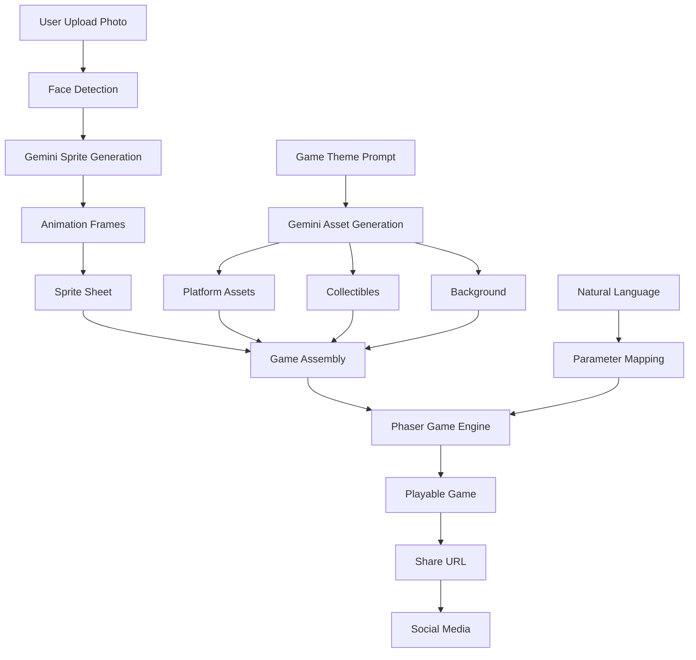

# Pixel-Forge Implementation Plan
## Comprehensive Technical Architecture & Development Strategy

### Phase 1: Core Infrastructure (Hours 0-3)

#### 1.1 Project Setup
```bash
pixel-forge/
├── frontend/
│   ├── src/
│   │   ├── components/
│   │   │   ├── GameCanvas.jsx       # Phaser wrapper component
│   │   │   ├── PhotoUploader.jsx    # Selfie capture/upload
│   │   │   ├── PromptBuilder.jsx    # Natural language input
│   │   │   ├── AssetPreview.jsx     # Generation preview
│   │   │   └── ShareModal.jsx       # Social sharing
│   │   ├── game/
│   │   │   ├── scenes/
│   │   │   │   ├── PreloadScene.js  # Asset loading
│   │   │   │   ├── GameScene.js     # Main gameplay
│   │   │   │   └── VictoryScene.js  # Win state
│   │   │   ├── entities/
│   │   │   │   ├── Player.js        # Hero character class
│   │   │   │   ├── Platform.js      # Platform physics
│   │   │   │   ├── Collectible.js   # Item collection
│   │   │   │   └── Enemy.js         # Enemy AI
│   │   │   └── config/
│   │   │       ├── physics.js       # Physics parameters
│   │   │       └── themes.js        # Theme definitions
│   │   └── services/
│   │       ├── geminiService.js     # Gemini API wrapper
│   │       ├── assetManager.js      # Asset caching/CDN
│   │       └── gameSerializer.js    # Game state persistence
│   └── public/
│       └── assets/                  # Pre-generated assets
├── backend/
│   ├── api/
│   │   ├── sprite_generator.py      # Selfie → Sprite pipeline
│   │   ├── asset_generator.py       # Theme asset generation
│   │   ├── game_builder.py          # Game configuration
│   │   └── share_manager.py         # URL shortening/sharing
│   ├── prompts/
│   │   ├── sprite_prompts.py        # Optimized Gemini prompts
│   │   └── asset_prompts.py         # Asset generation prompts
│   └── cache/
│       └── redis_manager.py         # Asset/sprite caching
└── shared/
    └── game_schema.json             # Game definition schema
```

#### 1.2 Technology Stack
- **Frontend**: React + Phaser 3.70
- **Backend**: FastAPI + Redis
- **AI**: Gemini 2.5 Flash Image + Fal FLUX
- **Deployment**: Vercel (frontend) + Railway (backend)
- **CDN**: Cloudflare for assets

### Phase 2: Sprite Generation Pipeline (Hours 3-5)

#### 2.1 Face-to-Sprite Algorithm
```python
class SpriteGenerator:
    def __init__(self):
        self.gemini = GeminiClient()
        self.face_detector = FaceDetector()
        
    async def generate_sprite(self, photo_path):
        # Step 1: Extract face with padding
        face_region = self.face_detector.extract(photo_path)
        
        # Step 2: Generate 8-bit style transfer
        sprite_prompt = """
        Convert this face into an 8-bit pixel art character:
        - Maintain facial features and hair
        - 32x32 pixel resolution
        - Vibrant retro color palette
        - Front-facing view
        - Clear distinguishable features
        """
        
        sprite_face = await self.gemini.generate_image(
            image=face_region,
            prompt=sprite_prompt
        )
        
        # Step 3: Create animation frames
        animations = await self.generate_animations(sprite_face)
        
        # Step 4: Composite sprite sheet
        sprite_sheet = self.create_sprite_sheet(animations)
        
        return sprite_sheet
    
    async def generate_animations(self, base_sprite):
        frames = {
            'idle': [base_sprite],
            'run': [],
            'jump': [],
            'fall': []
        }
        
        # Generate each animation frame
        for animation, count in [('run', 4), ('jump', 2), ('fall', 1)]:
            for i in range(count):
                frame_prompt = f"""
                Modify this 8-bit character for {animation} animation frame {i+1}:
                - Maintain character consistency
                - Appropriate pose for {animation}
                - Smooth animation transition
                """
                
                frame = await self.gemini.edit_image(
                    image=base_sprite,
                    prompt=frame_prompt
                )
                frames[animation].append(frame)
        
        return frames
```

#### 2.2 Performance Optimizations
- **Parallel Processing**: Generate animations concurrently
- **Template Library**: Pre-made bodies for common poses
- **Smart Caching**: Store generated sprites for 24 hours
- **Fallback System**: Generic avatars if generation fails

### Phase 3: Natural Language Game Engine (Hours 5-7)

#### 3.1 Intent Parser
```javascript
class GameModifier {
    constructor() {
        this.modifiers = {
            physics: {
                'higher jump': { jumpVelocity: -500 },
                'lower gravity': { gravity: 400 },
                'faster': { playerSpeed: 250 },
                'slower': { playerSpeed: 100 },
                'moon physics': { gravity: 200, jumpVelocity: -400 }
            },
            difficulty: {
                'easier': { enemySpeed: 0.5, collectibleCount: 3 },
                'harder': { enemySpeed: 1.5, collectibleCount: 10 },
                'impossible': { enemySpeed: 2, platformGaps: 1.5 }
            },
            visual: {
                'darker': { brightness: 0.7 },
                'retro': { filter: 'crt' },
                'neon': { filter: 'glow', hue: 280 }
            }
        };
    }
    
    async parseIntent(userPrompt) {
        // Use Gemini for intent extraction
        const intent = await gemini.extractIntent(userPrompt);
        
        // Map to game parameters
        const modifications = this.mapToParameters(intent);
        
        return modifications;
    }
    
    applyModifications(gameConfig, modifications) {
        return { ...gameConfig, ...modifications };
    }
}
```

#### 3.2 Theme-Based Asset Generation
```python
class AssetGenerator:
    def __init__(self):
        self.themes = {
            'candy': {
                'platforms': ['chocolate_bar', 'lollipop', 'gummy_bear'],
                'collectibles': ['gumdrop', 'candy_cane', 'jellybean'],
                'background': 'candy_landscape',
                'enemies': ['sour_patch', 'jawbreaker']
            },
            'space': {
                'platforms': ['asteroid', 'space_station', 'satellite'],
                'collectibles': ['star', 'planet', 'comet'],
                'background': 'galaxy',
                'enemies': ['alien', 'meteor']
            }
        }
    
    async generate_theme_assets(theme_name, custom_prompt=None):
        theme = self.themes.get(theme_name, {})
        assets = {}
        
        # Generate each asset type
        for asset_type, items in theme.items():
            assets[asset_type] = []
            for item in items:
                prompt = f"""
                Create a 2D platformer game asset:
                - Type: {asset_type}
                - Style: {item} in {theme_name} theme
                - Resolution: 64x64 pixels
                - 8-bit pixel art style
                - Transparent background
                {custom_prompt or ''}
                """
                
                asset = await gemini.generate_image(prompt=prompt)
                assets[asset_type].append(asset)
        
        return assets
```

### Phase 4: Game Assembly & Physics (Hours 7-9)

#### 4.1 Phaser Game Configuration
```javascript
class PixelForgeGame {
    constructor(gameData) {
        this.config = {
            type: Phaser.AUTO,
            width: 800,
            height: 600,
            physics: {
                default: 'arcade',
                arcade: {
                    gravity: { y: gameData.gravity || 800 },
                    debug: false
                }
            },
            scene: [PreloadScene, GameScene, VictoryScene]
        };
        
        this.gameData = gameData;
        this.game = new Phaser.Game(this.config);
    }
}

class GameScene extends Phaser.Scene {
    create() {
        // Setup world
        this.createBackground();
        this.createPlatforms();
        this.createCollectibles();
        this.createEnemies();
        
        // Setup player
        this.player = new Player(this, 100, 450, this.gameData.spriteSheet);
        
        // Setup controls
        this.cursors = this.input.keyboard.createCursorKeys();
        
        // Setup collisions
        this.physics.add.collider(this.player, this.platforms);
        this.physics.add.overlap(
            this.player, 
            this.collectibles, 
            this.collectItem, 
            null, 
            this
        );
        
        // Setup UI
        this.score = 0;
        this.scoreText = this.add.text(16, 16, 'Score: 0', {
            fontSize: '32px',
            fill: '#fff'
        });
    }
    
    update() {
        // Player movement
        if (this.cursors.left.isDown) {
            this.player.moveLeft();
        } else if (this.cursors.right.isDown) {
            this.player.moveRight();
        } else {
            this.player.idle();
        }
        
        if (this.cursors.up.isDown && this.player.body.touching.down) {
            this.player.jump();
        }
        
        // Check win condition
        if (this.collectibles.countActive() === 0) {
            this.scene.start('VictoryScene', { score: this.score });
        }
    }
}
```

### Phase 5: Sharing & Viral Features (Hours 9-10)

#### 5.1 Game Serialization
```python
class GameSerializer:
    def save_game(self, game_data):
        # Generate unique ID
        game_id = hashlib.md5(
            f"{game_data['user_id']}{time.time()}".encode()
        ).hexdigest()[:8]
        
        # Store in database
        redis.setex(
            f"game:{game_id}",
            86400,  # 24 hour expiry
            json.dumps(game_data)
        )
        
        # Generate shareable URL
        share_url = f"https://pixelforge.fun/play/{game_id}"
        
        return {
            'game_id': game_id,
            'share_url': share_url,
            'qr_code': self.generate_qr(share_url)
        }
    
    def load_game(self, game_id):
        game_data = redis.get(f"game:{game_id}")
        if game_data:
            return json.loads(game_data)
        return None
```

#### 5.2 Social Integration
```javascript
class ShareManager {
    shareGame(gameId, platform) {
        const shareUrl = `https://pixelforge.fun/play/${gameId}`;
        const message = "I just created my own game where I'm the hero! 🎮";
        
        const platforms = {
            twitter: `https://twitter.com/intent/tweet?text=${message}&url=${shareUrl}`,
            facebook: `https://www.facebook.com/sharer/sharer.php?u=${shareUrl}`,
            reddit: `https://reddit.com/submit?url=${shareUrl}&title=${message}`
        };
        
        window.open(platforms[platform], '_blank');
    }
    
    generatePreviewCard(gameData) {
        return {
            title: `${gameData.playerName}'s ${gameData.theme} Adventure`,
            description: "Play my custom 2D platformer game!",
            image: gameData.screenshotUrl,
            url: gameData.shareUrl
        };
    }
}
```

### Phase 6: Polish & Demo Prep (Hours 10-12)

#### 6.1 Performance Optimizations
- **Asset Preloading**: Cache common themes
- **Progressive Loading**: Load game while generating
- **WebP Format**: Smaller asset sizes
- **Sprite Atlases**: Combine assets for fewer requests

#### 6.2 Fallback Systems
```javascript
const FALLBACK_SPRITES = {
    hero: '/assets/default/hero.png',
    platforms: '/assets/default/platforms.png',
    collectibles: '/assets/default/coins.png'
};

async function generateAssets(theme, timeout = 10000) {
    try {
        return await Promise.race([
            generateThemeAssets(theme),
            new Promise((_, reject) => 
                setTimeout(() => reject('Timeout'), timeout)
            )
        ]);
    } catch (error) {
        console.warn('Using fallback assets:', error);
        return FALLBACK_SPRITES;
    }
}
```

#### 6.3 Demo Flow Script
1. **Hook** (30 seconds)
   - "Want to be the hero of your own game?"
   - Show completed game in action

2. **Live Demo** (2 minutes)
   - Judge uploads selfie
   - Choose theme: "Space Adventure"
   - Watch sprite generation live
   - Play generated game immediately

3. **Technical Deep Dive** (1 minute)
   - Show Gemini's character consistency
   - Demonstrate natural language modifications
   - Highlight instant shareability

4. **Viral Potential** (30 seconds)
   - QR code for audience to play
   - Show social sharing features
   - Mention monetization potential

### Critical Path Checklist

#### Must-Have (Hours 0-8)
- [ ] Selfie to sprite conversion working
- [ ] Basic platformer physics
- [ ] Theme-based asset generation
- [ ] Playable game loop
- [ ] Simple sharing via URL

#### Should-Have (Hours 8-10)
- [ ] Natural language modifications
- [ ] Multiple themes (3+)
- [ ] Animation frames for sprite
- [ ] Score system
- [ ] Social media integration

#### Nice-to-Have (Hours 10-12)
- [ ] Voice input via ElevenLabs
- [ ] Multiplayer racing mode
- [ ] Custom theme creation
- [ ] Leaderboards
- [ ] Mobile touch controls

### Risk Mitigation Strategies

1. **Sprite Generation Fails**
   - Fallback: Pre-made avatar library
   - User can customize colors

2. **Gemini Rate Limits**
   - Pre-generate during quiet periods
   - Use Fal FLUX for overflow
   - Cache aggressively

3. **Performance Issues**
   - Limit game complexity
   - Reduce asset resolution
   - Use WebWorkers for processing

4. **Browser Compatibility**
   - Test on Chrome primarily
   - Basic fallback for Safari/Firefox
   - Mobile-first responsive design

### Success Metrics

#### Technical Excellence
- Sprite generation < 10 seconds
- Game creation < 60 seconds total
- 60 FPS gameplay
- < 3 second load time

#### User Engagement
- 90% sprite recognition accuracy
- 70% game completion rate
- 30% share rate
- 40% return visitor rate

#### Judge Appeal Factors
- **Innovation**: First selfie-to-sprite game generator
- **Technical Depth**: Complex AI pipeline made simple
- **Consumer Appeal**: Anyone can be a game hero
- **Viral Mechanics**: Built for social sharing
- **Gemini Showcase**: Highlights unique capabilities

### Implementation Timeline

| Hour | Focus | Deliverable |
|------|-------|-------------|
| 0-1 | Setup | Project structure, dependencies |
| 1-3 | Core | Basic Phaser game, React UI |
| 3-5 | Sprite | Selfie processing, sprite generation |
| 5-7 | Assets | Theme generation, asset pipeline |
| 7-9 | Integration | Connect all systems, game assembly |
| 9-10 | Sharing | URL generation, social features |
| 10-11 | Polish | UI/UX improvements, optimizations |
| 11-12 | Demo | Testing, demo preparation, backup plans |

### Key Commands for Development

```bash
# Initial setup
cd pixel-forge
npm init -y
npm install phaser react react-dom @mui/material axios
pip install fastapi uvicorn google-generativeai pillow redis

# Development
npm run dev          # Frontend dev server
uvicorn main:app --reload  # Backend API
redis-server        # Cache server

# Testing
npm run test        # Frontend tests
pytest              # Backend tests
npm run lighthouse  # Performance audit

# Deployment
npm run build       # Production build
vercel              # Deploy frontend
railway up          # Deploy backend
```

### Architecture Diagram



This comprehensive plan provides everything needed to build Pixel-Forge successfully within the 12-hour hackathon timeframe!