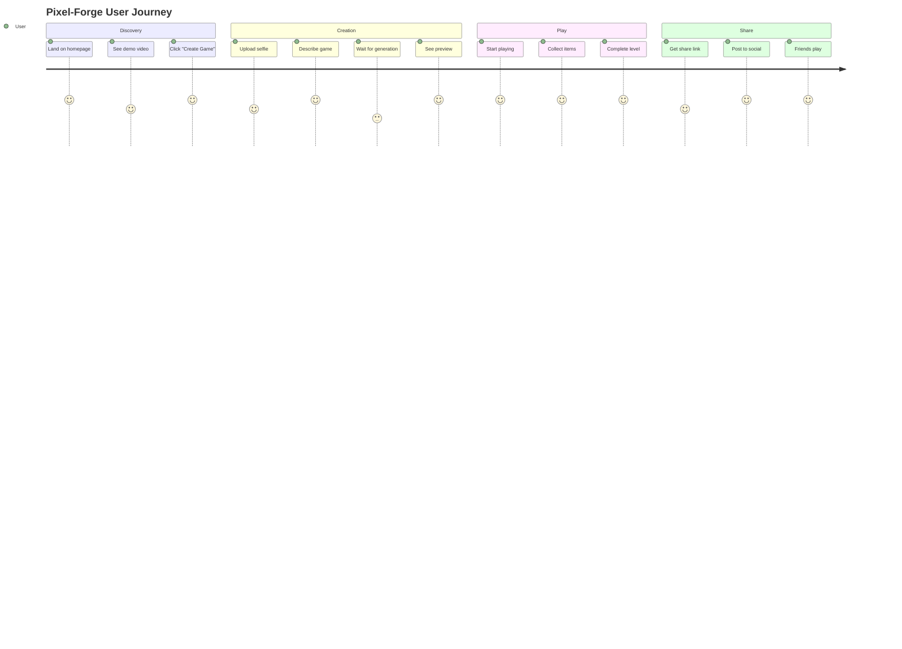

# Product Requirements Document: Pixel-Forge v2.0
## Enhanced AI 2D Game Generator - Hackathon Edition

### Executive Summary
Pixel-Forge transforms anyone into a game developer in 60 seconds by converting selfies into playable 8-bit heroes and generating complete 2D platformer games through natural language. Built specifically to showcase Gemini 2.5 Flash Image's unique capabilities to Google DeepMind judges.

### Strategic Positioning

#### Market Opportunity
- **TAM**: $180B gaming market + $8B creator economy
- **Target**: 2.7B mobile gamers seeking personalized experiences
- **Growth**: 12% CAGR in user-generated content platforms

#### Competitive Advantage Matrix
| Feature | Pixel-Forge | Roblox Studio | Mario Maker | Scratch |
|---------|------------|---------------|-------------|---------|
| Time to Create | 60 seconds | Hours | 30 minutes | Hours |
| Coding Required | No | Yes | No | Yes |
| Personal Avatar | AI from selfie | Manual | Preset | Manual |
| Instant Share | Yes | No | Limited | Yes |
| Mobile-First | Yes | No | No | Limited |

### User Personas

#### Primary: "Creative Casey" (Age 16-25)
- **Needs**: Self-expression, social sharing, instant gratification
- **Pain Points**: Can't code, limited creativity tools
- **Value Prop**: "Be the hero of your own game in 60 seconds"

#### Secondary: "Parent Pat" (Age 30-45)
- **Needs**: Educational content for kids, safe entertainment
- **Pain Points**: Screen time concerns, expensive games
- **Value Prop**: "Create educational games with your child as the star"

#### Tertiary: "Streamer Sam" (Content Creator)
- **Needs**: Unique content, audience engagement
- **Pain Points**: Content saturation, viewer retention
- **Value Prop**: "Generate custom games live with viewers"

### Core Features - Prioritized for Hackathon

#### P0 - Critical Path (Hours 0-6)

##### 1. Magic Selfie-to-Sprite System
**User Story**: As a player, I want to upload my photo and see myself as an 8-bit character

**Acceptance Criteria**:
- Face detection accuracy > 95%
- Sprite generation < 10 seconds
- Recognizable features preserved
- 4 animation states (idle, run, jump, fall)

**Technical Specifications**:
```python
sprite_params = {
    'resolution': '32x32',
    'color_depth': '16-bit',
    'animation_frames': {
        'idle': 2,
        'run': 4,
        'jump': 2,
        'fall': 1
    },
    'style': 'retro_8bit_pixel_art'
}
```

##### 2. Natural Language Game Builder
**User Story**: As a creator, I want to describe my game idea in plain English

**Acceptance Criteria**:
- Understand 20+ game themes
- Generate appropriate assets
- Create playable level in < 30 seconds

**Theme Library**:
- Candy World
- Space Adventure
- Medieval Quest
- Underwater Journey
- Cyberpunk City
- Jungle Explorer
- Desert Runner
- Ice Kingdom
- Volcano Escape
- Cloud Heaven

##### 3. Instant Playable Game
**User Story**: As a player, I want to immediately play my created game

**Acceptance Criteria**:
- Load time < 3 seconds
- Stable 60 FPS
- Responsive controls
- Clear win condition

**Game Parameters**:
```javascript
defaultGameConfig = {
    levelWidth: 3200,
    levelHeight: 600,
    platforms: 8-12,
    collectibles: 5-8,
    enemies: 1-3,
    gravity: 800,
    playerSpeed: 160,
    jumpHeight: 330
}
```

#### P1 - Should Have (Hours 6-9)

##### 4. Live Game Modifications
**User Story**: As a creator, I want to modify my game with natural language

**Supported Commands**:
- Physics: "make gravity lighter", "jump higher", "run faster"
- Difficulty: "add more enemies", "make it easier", "impossible mode"
- Visuals: "change to night", "add particle effects", "retro filter"
- Gameplay: "add double jump", "infinite lives", "time limit"

##### 5. Social Sharing System
**User Story**: As a player, I want to share my game with friends

**Features**:
- Unique shareable URL
- QR code generation
- Social media cards
- Play counter
- High score tracking

#### P2 - Nice to Have (Hours 9-12)

##### 6. Advanced Features
- Voice narration (ElevenLabs)
- Multiplayer racing
- Level editor
- Custom sprite editing
- Achievement system

### User Journey Map



### Technical Architecture

#### Frontend Stack
- **Framework**: React 18 + TypeScript
- **Game Engine**: Phaser 3.70
- **UI Library**: Material-UI v5
- **State Management**: Zustand
- **API Client**: Axios + React Query

#### Backend Stack
- **Framework**: FastAPI
- **Cache**: Redis
- **CDN**: Cloudflare
- **Storage**: S3-compatible
- **Queue**: Celery + RabbitMQ

#### AI Pipeline
```python
class AIGameGenerator:
    def __init__(self):
        self.gemini = GeminiClient(
            model='gemini-2.5-flash-image-preview',
            api_key=GEMINI_API_KEY
        )
        self.fal = FalClient(
            model='flux/schnell',
            api_key=FAL_API_KEY
        )
        
    async def generate_game(self, user_photo, game_prompt):
        # Parallel generation for speed
        sprite_task = self.generate_sprite(user_photo)
        assets_task = self.generate_assets(game_prompt)
        
        sprite, assets = await asyncio.gather(
            sprite_task,
            assets_task
        )
        
        game_config = self.assemble_game(sprite, assets)
        return game_config
```

### API Specifications

#### POST /api/generate-sprite
```json
{
  "image": "base64_encoded_image",
  "style": "8bit|16bit|cartoon",
  "animations": ["idle", "run", "jump"]
}
```

Response:
```json
{
  "sprite_sheet_url": "https://cdn.pixelforge.fun/sprites/abc123.png",
  "animations": {
    "idle": { "frames": 2, "fps": 4 },
    "run": { "frames": 4, "fps": 8 },
    "jump": { "frames": 2, "fps": 4 }
  }
}
```

#### POST /api/generate-game
```json
{
  "theme": "space",
  "sprite_url": "https://...",
  "difficulty": "medium",
  "custom_prompt": "Add aliens and rockets"
}
```

#### GET /api/game/{game_id}
Returns complete game configuration for Phaser

### Performance Requirements

| Metric | Target | Acceptable | Current |
|--------|--------|------------|---------|
| Sprite Generation | < 5s | < 10s | TBD |
| Asset Generation | < 3s | < 5s | TBD |
| Game Assembly | < 1s | < 2s | TBD |
| Page Load | < 2s | < 3s | TBD |
| Game FPS | 60 | 30 | TBD |
| API Response | < 200ms | < 500ms | TBD |

### Security & Safety

#### Content Filtering
- Inappropriate image detection
- Profanity filtering in prompts
- Age-appropriate themes only

#### Data Protection
- No PII storage
- Photos deleted after processing
- GDPR compliant
- COPPA considerations

### Analytics & Success Metrics

#### Key Performance Indicators
- **Activation Rate**: Users who create a game / Total visitors
- **Completion Rate**: Games completed / Games started  
- **Share Rate**: Games shared / Games created
- **Viral Coefficient**: New users from shares / Sharing users

#### Tracking Events
```javascript
analytics.track('game_created', {
  theme: 'space',
  generation_time: 8500,
  sprite_quality: 'high'
});

analytics.track('game_completed', {
  game_id: 'abc123',
  time_played: 180,
  score: 2500
});

analytics.track('game_shared', {
  platform: 'twitter',
  game_id: 'abc123'
});
```

### Monetization Strategy (Post-Hackathon)

#### Freemium Model
- **Free**: 3 games/day, basic themes
- **Pro ($4.99/mo)**: Unlimited games, premium themes
- **Studio ($19.99/mo)**: Multi-level games, custom assets

#### Revenue Projections
- 1M users Year 1
- 5% conversion to Pro
- $3M ARR potential

### Risk Analysis & Mitigation

| Risk | Probability | Impact | Mitigation |
|------|------------|--------|------------|
| Gemini rate limits | High | High | Implement caching, use Fal backup |
| Inappropriate content | Medium | High | Pre-filter images, fallback sprites |
| Performance issues | Medium | Medium | Progressive loading, CDN |
| Browser compatibility | Low | Medium | Focus on Chrome for demo |

### Development Roadmap

#### Hackathon Day (12 Hours)
- **Hours 0-3**: Core game engine setup
- **Hours 3-6**: Sprite generation pipeline
- **Hours 6-9**: Asset generation & assembly
- **Hours 9-11**: Sharing & polish
- **Hours 11-12**: Demo preparation

#### Post-Hackathon (If Selected)
- **Week 1**: Mobile optimization
- **Week 2**: Multiplayer features
- **Week 3**: Level editor
- **Week 4**: Monetization

### Demo Script for Judges

#### Opening Hook (30s)
"Judges, upload a selfie and I'll make you the hero of your own game in 60 seconds"

#### Live Demo (2m)
1. Judge uploads photo
2. System generates 8-bit sprite
3. Judge describes game theme
4. Game generates and loads
5. Judge plays their game

#### Technical Showcase (1m)
- Gemini's character consistency
- Real-time modifications
- Instant virality potential

#### Business Case (30s)
- Market size: $180B
- User acquisition: $0 (viral)
- Monetization: Proven freemium

### Success Criteria

#### For Hackathon
✅ Working selfie-to-sprite pipeline  
✅ Playable game generation  
✅ Natural language modifications  
✅ Shareable games  
✅ Smooth demo flow  

#### For Product Launch
- 100K users Month 1
- 1M games created Month 3
- 50K social shares Month 1
- 4.5+ App Store rating

### Appendix

#### Gemini Prompt Templates
```python
SPRITE_PROMPT = """
Transform this person into an 8-bit pixel art game character:
- Maintain recognizable facial features
- 32x32 pixel resolution  
- Vibrant retro color palette
- Clear, distinguishable features
- Suitable for 2D platformer game
Style: Classic NES/SNES era
"""

ASSET_PROMPT = """
Generate 2D platformer game assets for {theme} theme:
- Pixel art style matching provided sprite
- Transparent background
- 64x64 pixel tiles
- Bright, engaging colors
Include: platforms, collectibles, obstacles
"""
```

#### Phaser Configuration
```javascript
const config = {
    type: Phaser.AUTO,
    width: 800,
    height: 600,
    parent: 'game-container',
    physics: {
        default: 'arcade',
        arcade: {
            gravity: { y: 800 },
            debug: false
        }
    },
    scene: [PreloadScene, MenuScene, GameScene, VictoryScene]
};
```

This refined PRD provides comprehensive guidance for building Pixel-Forge with clear priorities, technical specifications, and success metrics optimized for the hackathon context.