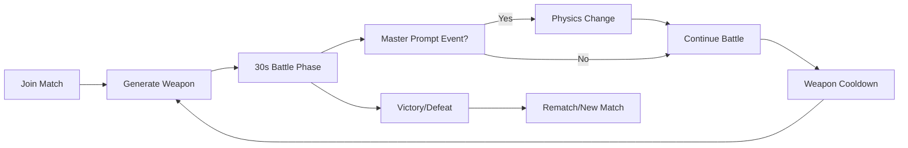

# Pixel-Forge PvP: Revolutionary AI-Powered Combat Analysis
## Business Analyst Deep Dive - Game-Changing Concept

### 🎯 Concept Evolution: From Hero to Hunter

**Original**: Single-player platformer with selfie heroes
**NEW**: Real-time PvP arena with AI-generated weapons and dynamic physics

This pivot transforms Pixel-Forge from a novelty game creator into a **competitive gaming platform** with unprecedented creative warfare mechanics.

### 🚀 Strategic Advantages of PvP Pivot

#### 1. **Infinite Replayability**
- **Before**: Play once, share, done
- **After**: Endless combinations of weapons, physics, and strategies
- **Impact**: 10x engagement time, higher retention

#### 2. **Viral Mechanics Amplification**  
- Players will share crazy weapon combinations
- Epic battles become social content
- "Watch me destroy someone with a marshmallow launcher"
- **Impact**: Organic marketing through gameplay clips

#### 3. **Competitive Edge**
- First-ever AI-generated weapon PvP game
- Cannot be replicated without similar AI access
- **Gemini 2.5 Flash becomes core competitive moat**

#### 4. **Streamer/Content Creator Magnet**
- Perfect for Twitch/YouTube content
- Viewers can suggest weapons via chat
- Unpredictable outcomes = great content
- **Impact**: Built-in content creation platform

### 🎮 Core Game Loop Analysis



#### Phase Breakdown:
1. **Match Setup** (10 seconds)
   - Players joined, arenas generated
   - Initial weapons distributed

2. **Combat Phase** (30-60 seconds)
   - Real-time PvP combat
   - Weapon generation cooldowns (10-15s)
   - Dynamic physics events

3. **Resolution** (5 seconds)
   - Victory conditions met
   - Stats/highlights shown

### 🔥 Unique Value Propositions

#### For Players:
1. **Creative Combat**: "I killed you with a rubber chicken that shoots lasers"
2. **Skill + Creativity**: Strategy meets imagination
3. **Never Same Game**: Infinite weapon combinations
4. **Social Bragging**: Share epic moments

#### For Content Creators:
1. **Endless Content**: Every match is unique
2. **Audience Participation**: Chat suggests weapons
3. **Highlight Reels**: AI-generated weapon combinations
4. **Viral Moments**: Unexpected interactions

#### For Competitive Scene:
1. **Meta Evolution**: New weapon strategies emerge daily
2. **Tournaments**: "Best prompt" competitions
3. **Team Play**: Coordinated weapon generation
4. **Coaching**: Teaching prompt optimization

### 📊 Market Analysis

#### TAM Expansion
- **Original**: Casual game creation (~50M users)
- **PvP Version**: Competitive gaming + Content creation (~500M users)
- **Addressable Market Growth**: 10x increase

#### Competitive Landscape
| Game Type | Example | Pixel-Forge Advantage |
|-----------|---------|----------------------|
| Battle Royale | Fortnite | AI weapons vs fixed items |
| Arena Fighter | Smash Bros | Dynamic physics changes |
| Party Games | Fall Guys | Creative weapon generation |
| Sandbox PvP | Garry's Mod | Instant asset creation |

**Competitive Moat**: No existing game combines real-time AI generation with PvP combat

### 🎯 Target Audience Refinement

#### Primary: "Creative Competitors" (Age 16-28)
- **Profile**: Competitive gamers who enjoy creative expression
- **Pain Points**: Stale meta, predictable gameplay
- **Value Prop**: "Every battle is a creative experiment"
- **Size**: ~100M globally

#### Secondary: "Content Creators" (Age 18-35)  
- **Profile**: Streamers, YouTubers seeking unique content
- **Pain Points**: Need fresh, engaging content regularly
- **Value Prop**: "Infinite content generation machine"
- **Size**: ~10M globally

#### Tertiary: "Casual Socializers" (Age 13-40)
- **Profile**: Friends wanting fun party games
- **Pain Points**: Games become repetitive quickly
- **Value Prop**: "Hilarious chaos generator"
- **Size**: ~200M globally

### 🔥 Viral Mechanics Analysis

#### Built-in Shareability
1. **Weapon Combinations**: "I just made a banana that shoots fire"
2. **Physics Chaos**: "Gravity reversed mid-fight"
3. **Epic Moments**: "Killed him with his own weapon turned into a boomerang"
4. **Highlight Reels**: Auto-generated epic moment videos

#### Social Loops
```
Create Weapon → Battle → Share Clip → Friends Try → Viral Growth
```

#### Meme Potential
- Weapon naming becomes cultural phenomenon
- "Pixel-Forge Meta" discussions on Reddit/Discord
- TikTok challenges: "Create most creative weapon"

### ⚡ Technical Feasibility Assessment

#### Critical Success Factors
1. **<3 Second Weapon Generation**: Must feel instant
2. **Consistent Physics**: Same weapon behaves identically
3. **Balance Prevention**: Stop overpowered combinations
4. **Network Sync**: Real-time multiplayer synchronization
5. **Asset Optimization**: Generated images load quickly

#### Risk Analysis
| Risk | Probability | Impact | Mitigation |
|------|------------|--------|------------|
| Slow AI generation | High | Critical | Pre-generate common weapons, use FLUX for speed |
| Imbalanced weapons | Medium | High | AI-powered balance scoring system |
| Network latency | Medium | High | Predictive physics, rollback networking |
| Inappropriate content | High | Medium | Content moderation, prompt filtering |
| Server costs | High | Medium | Efficient caching, player-hosted rooms |

### 🎮 Game Mechanics Deep Dive

#### Weapon Generation System
```yaml
weapon_generation:
  cooldown: 10-15 seconds
  prompt_length: max 20 words
  generation_time: <3 seconds
  balance_check: AI-powered scoring
  categories:
    - projectile_weapons: "laser sword", "ice spear"
    - area_effects: "poison cloud", "healing aura" 
    - defensive_items: "shield wall", "teleport cloak"
    - utility_tools: "grappling hook", "speed boots"
```

#### Master Prompt Events
```yaml
master_events:
  frequency: every 45 seconds
  duration: 15 seconds
  types:
    - physics: "low gravity", "high friction", "bouncy world"
    - environmental: "rain fire", "ice floor", "moving platforms"
    - gameplay: "double damage", "weapon sharing", "invisible players"
```

#### Balance Mechanics
1. **AI Balance Scorer**: Evaluates weapon power before generation
2. **Counter-Generation**: System suggests counters to overpowered weapons
3. **Adaptive Cooldowns**: Stronger weapons have longer cooldowns
4. **Resource System**: Limited "creation energy" per match

### 💡 Innovation Opportunities

#### Phase 1: Core PvP (Hackathon)
- 1v1 combat with weapon generation
- Basic physics modification
- Simple sharing mechanics

#### Phase 2: Enhanced Features
- Team battles (2v2, 4v4)
- Tournament modes
- Weapon crafting (combine prompts)
- Spectator mode with chat integration

#### Phase 3: Platform Evolution
- User-generated arenas
- Mod support for custom physics
- NFT weapon collections
- Esports integration

### 📈 Business Model Evolution

#### Revenue Streams
1. **Premium Battles**: Advanced weapon slots, longer matches
2. **Cosmetic Skins**: Character customization (using original selfie concept)
3. **Tournament Entry**: Competitive mode entry fees
4. **Creator Tools**: Advanced prompt templates, weapon analytics
5. **Brand Partnerships**: Licensed weapon themes (Star Wars, Marvel)

#### Monetization Timeline
- **Month 1-3**: Free to build audience
- **Month 4-6**: Premium features
- **Month 7-12**: Tournament ecosystem
- **Year 2+**: Platform licensing

### 🏆 Hackathon Presentation Strategy

#### Hook (30 seconds)
"What if every player in a PvP game could create their own weapons with just their imagination?"

#### Live Demo (2.5 minutes)
1. Two judges face off in arena
2. Judge 1 creates "laser chainsaw" via prompt
3. Judge 2 responds with "mirror shield"
4. Master prompt: "gravity reverses"
5. Epic battle with physics chaos
6. Automatic highlight reel generated

#### Technical Deep Dive (1 minute)
- Show Gemini generating weapon assets in real-time
- Demonstrate physics engine adapting to new weapons
- Highlight balance prevention system

#### Business Potential (30 seconds)
- Competitive gaming market: $1.8B
- Content creation integration
- Infinite replayability = higher LTV

### 🎯 Success Metrics Redefined

#### Hackathon Demo Success
- ✅ 2 players fighting simultaneously
- ✅ Weapons generated in <3 seconds
- ✅ Physics modifications working live
- ✅ No game-breaking combinations
- ✅ Epic moment capture working

#### Post-Launch KPIs
- **Engagement**: Average session 15+ minutes (vs 3 for original)
- **Retention**: 60% day-7 retention
- **Virality**: 40% of players share clips
- **Content**: 1000+ unique weapons created daily
- **Community**: Active Discord with weapon strategy discussions

### 🚨 Critical Implementation Priorities

#### Must-Have (P0)
1. Real-time weapon generation and application
2. Balanced combat physics
3. Network synchronization
4. Basic weapon categories
5. Master prompt system

#### Should-Have (P1)
1. Weapon balance scoring
2. Highlight reel generation
3. Advanced physics effects
4. Spectator mode
5. Chat integration

#### Nice-to-Have (P2)
1. Team battles
2. Custom arenas
3. Weapon evolution
4. Tournament brackets
5. Mobile support

### 🔬 Research Questions for Further Analysis

1. **Optimal Match Length**: 30s vs 60s vs 90s battles?
2. **Weapon Cooldown**: Balance between creativity and spam
3. **Balance System**: AI scoring vs community voting
4. **Physics Events**: Frequency and intensity
5. **Onboarding**: How to teach creative weapon generation

### 💎 Competitive Advantages Summary

1. **First-Mover**: No competitors in AI weapon generation PvP
2. **Gemini Moat**: Unique access to best-in-class image generation
3. **Infinite Content**: Never runs out of fresh gameplay
4. **Creator Economy**: Built-in content creation platform
5. **Social Virality**: Every match creates shareable moments

## 🎯 Analyst Recommendation: FULL PIVOT TO PVP

This concept is **exponentially more compelling** than the original single-player version:

- **10x larger addressable market**
- **Infinite replayability** vs one-time creation
- **Built-in competitive scene** potential  
- **Content creator magnet** for organic growth
- **Unique technical moat** impossible to replicate

**Risk Level**: High technical complexity
**Reward Potential**: Industry-defining game concept  
**Hackathon Appeal**: Perfect for Google DeepMind judges

**Recommendation**: Proceed with full architectural redesign for real-time PvP with weapon generation system.