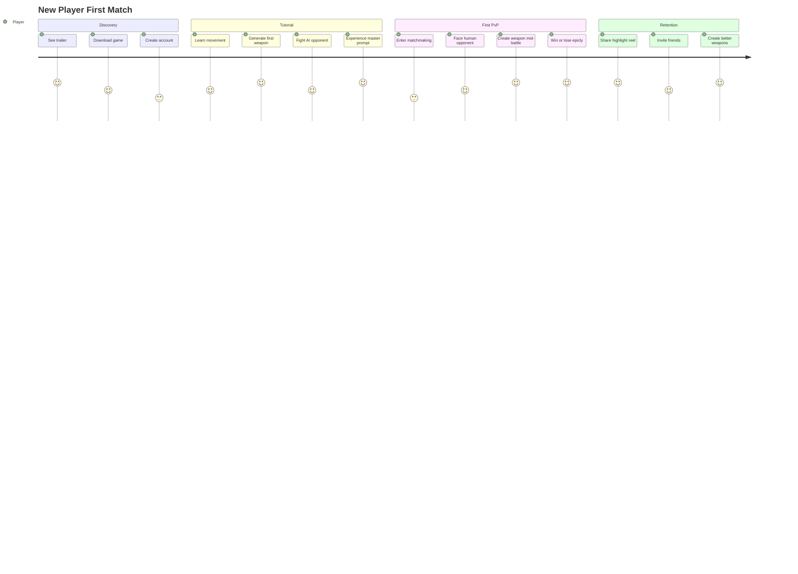

# Product Requirements Document: Pixel-Forge PvP
## Revolutionary AI-Powered Combat Arena

### Executive Summary

Pixel-Forge PvP transforms competitive gaming by enabling players to create custom weapons through natural language during real-time combat. Players face off in dynamic arenas where imagination becomes weaponry, physics can be rewritten on command, and every battle creates unique, shareable moments.

**Core Innovation**: First-ever real-time AI weapon generation in competitive PvP gameplay.

### Product Vision

**"Where creativity meets competition"**

Transform PvP gaming from predictable meta to infinite creative warfare, making every player a weapon designer and every battle a unique experiment in physics and strategy.

### Strategic Context

#### Market Opportunity
- **Competitive Gaming**: $1.8B market growing 15% annually
- **Content Creation**: $13B creator economy seeking fresh content
- **Social Gaming**: 2.7B players wanting innovative experiences

#### Unique Position
- **First-mover** in AI-generated weapon PvP
- **Gemini 2.5 Flash** provides unassailable technical moat
- **Infinite content** solves industry's biggest problem: stale meta

### User Personas

#### Primary: "Creative Combatant" (Age 16-25)
**Profile**: Competitive gamer who values creative expression
- **Needs**: Fresh gameplay, skill-based competition, creative outlet
- **Pain Points**: Predictable metas, limited weapon variety
- **Goals**: Become known for innovative weapon combinations
- **Value Prop**: "Your imagination is your greatest weapon"

#### Secondary: "Content Creator" (Age 20-30)
**Profile**: Streamer/YouTuber needing engaging content
- **Needs**: Unique content, audience engagement, viral moments
- **Pain Points**: Content saturation, viewer retention challenges
- **Goals**: Create memorable, shareable gaming moments
- **Value Prop**: "Every stream is a weapon invention laboratory"

### Core Features

## Phase 1: MVP Arena Combat (P0)

### F1: Real-Time Weapon Generation
**Epic**: As a player, I want to create custom weapons during combat so I can adapt to any situation

#### User Stories:
```gherkin
Feature: Dynamic Weapon Creation
  Scenario: Player creates weapon during battle
    Given I am in combat with cooldown available
    When I type "flaming crossbow" in prompt window
    Then weapon generates in <3 seconds
    And weapon appears in my inventory slot
    And weapon has balanced damage/speed stats
    
  Scenario: Weapon cooldown management
    Given I just created a weapon
    When I try to create another weapon
    Then I see cooldown timer (10-15 seconds)
    And I can see preview of next weapon slot availability
```

#### Acceptance Criteria:
- Weapon generation completes in <3 seconds
- Generated weapons maintain visual consistency with game art style
- Weapons automatically balanced via AI scoring system
- Maximum 20-word prompt length
- Cooldown prevents generation spam

#### Technical Requirements:
```yaml
weapon_generation:
  api_timeout: 3000ms
  prompt_validation: profanity_filter, length_check
  balance_scoring: AI-powered (0-100 scale)
  asset_format: 64x64 PNG sprites
  physics_properties: mass, damage, speed, range, special_effects
```

### F2: Arena Combat System
**Epic**: As a player, I want to battle opponents with generated weapons in balanced combat

#### User Stories:
```gherkin
Feature: PvP Combat Arena
  Scenario: 1v1 battle with weapon variety
    Given two players in combat arena
    When players use different generated weapons
    Then combat feels balanced and skill-based
    And weapon interactions create interesting emergent gameplay
    
  Scenario: Victory conditions
    Given players are battling
    When one player's health reaches zero
    Then victory screen shows winner
    And highlight reel of best moments displays
    And players offered immediate rematch
```

#### Combat Specifications:
```yaml
arena_config:
  dimensions: 1200x600 pixels
  player_health: 100 HP
  match_duration: 60-90 seconds
  victory_conditions: 
    - health_depletion
    - time_limit (higher_health_wins)
  respawn_time: 3 seconds
  weapon_slots: 2 active, 1 generating
```

### F3: Master Prompt Physics Events
**Epic**: As a game master system, I want to periodically modify physics to create dynamic gameplay moments

#### User Stories:
```gherkin
Feature: Dynamic Physics Modification
  Scenario: Master prompt changes physics
    Given players are in mid-battle
    When master prompt "low gravity" triggers
    Then all physics instantly adapt
    And players must adjust strategies
    And effect lasts 15-20 seconds
    
  Scenario: Environmental chaos events
    Given match has been active for 45 seconds
    When environmental event "ice floor" occurs
    Then arena properties change
    And player movement adapts to new conditions
```

#### Master Prompt System:
```yaml
master_events:
  trigger_frequency: every 30-45 seconds
  effect_duration: 15-20 seconds
  categories:
    physics_mods:
      - "low_gravity": gravity *= 0.3
      - "high_friction": player_speed *= 0.5
      - "bouncy_world": surface_restitution *= 2
    environmental:
      - "ice_floor": friction *= 0.1
      - "fire_rain": periodic_damage_zones
      - "moving_platforms": dynamic_terrain
    gameplay_mods:
      - "double_damage": all_damage *= 2
      - "weapon_sharing": weapons_become_pickups
      - "speed_mode": all_speeds *= 1.5
```

## Phase 2: Enhanced Combat (P1)

### F4: Advanced Weapon Categories
**Epic**: As a player, I want access to diverse weapon types for complex strategic gameplay

#### Weapon Categories:
```yaml
weapon_types:
  projectile:
    examples: ["laser_rifle", "ice_spear", "bouncing_bomb"]
    properties: range, projectile_speed, damage, bounce_count
  
  melee:
    examples: ["flame_sword", "electric_whip", "giant_hammer"]
    properties: reach, swing_speed, damage, special_effect
  
  area_effect:
    examples: ["poison_cloud", "healing_aura", "force_field"]
    properties: radius, duration, intensity, ally_effect
  
  utility:
    examples: ["grappling_hook", "teleport_device", "shield_wall"]
    properties: cooldown, duration, range, defensive_value
  
  combo_weapons:
    examples: ["sword_that_shoots_fire", "shield_with_spikes"]
    properties: combines_two_categories, higher_cost
```

### F5: Weapon Balance System
**Epic**: As a player, I want weapon generation to create balanced, fair combat experiences

#### Balance Mechanics:
```yaml
balance_system:
  ai_scoring:
    damage_potential: 0-100 scale
    utility_value: 0-100 scale
    complexity_bonus: unique_mechanics_reward
    
  balance_enforcement:
    high_power_weapons: longer_cooldowns, limited_ammo
    utility_weapons: lower_damage, strategic_value
    combo_weapons: significant_cooldown_penalty
    
  counter_suggestions:
    system_suggests: "Enemy has fire weapon, try ice shield"
    player_choice: accept_suggestion_or_create_custom
```

### F6: Social Integration
**Epic**: As a player, I want to share epic battle moments and build community around creative combat

#### Features:
```yaml
social_features:
  highlight_reels:
    auto_generation: best_moments_from_match
    editing_tools: trim, add_text, effects
    sharing: direct_links, social_media_integration
    
  weapon_gallery:
    community_showcase: best_weapons_created
    voting_system: players_vote_on_creativity
    featured_weapons: daily_highlights
    
  tournament_system:
    bracket_creation: automated_matchmaking
    spectator_mode: watch_matches_live
    chat_integration: audience_suggests_weapons
```

## Phase 3: Platform Features (P2)

### F7: Team Combat Modes
**Epic**: As a player, I want to coordinate weapon creation with teammates for strategic team play

### F8: Custom Arenas
**Epic**: As a creator, I want to design custom battle arenas with unique physics properties

### F9: Weapon Evolution System
**Epic**: As a dedicated player, I want to upgrade and evolve my most successful weapon creations

## Technical Requirements

### Performance Specifications
| Metric | Target | Acceptable | Critical |
|--------|--------|------------|----------|
| Weapon Generation | <2s | <3s | <5s |
| Arena Load Time | <1s | <2s | <3s |
| Network Latency | <50ms | <100ms | <150ms |
| Frame Rate | 60 FPS | 45 FPS | 30 FPS |
| Match Stability | 99.9% | 99.5% | 99% |
| Concurrent Users | 10K | 5K | 1K |

### Scalability Requirements
```yaml
infrastructure:
  concurrent_matches: 500 simultaneous
  weapon_generation_queue: 100 requests/second
  asset_cdn: global_distribution_required
  database: low_latency_weapon_lookup
  
matchmaking:
  skill_based: ELO_rating_system
  latency_based: regional_server_selection
  queue_time: <30_seconds_target
```

## User Experience Flow

### Onboarding Journey


### Core Gameplay Loop
```
Enter Arena → Generate Starting Weapon → Battle Begins → 
Adapt with New Weapons → Master Prompt Event → 
Strategic Adjustment → Victory/Defeat → 
Share Highlights → Immediate Rematch
```

## Business Model

### Revenue Strategy
#### Free Tier
- 3 matches per hour
- Basic weapon categories
- Standard arenas
- 720p highlight recording

#### Premium ($9.99/month)
- Unlimited matches
- Advanced weapon categories
- Custom arena access
- 4K highlight recording
- Priority matchmaking

#### Pro Creator ($19.99/month)
- Tournament hosting tools
- Advanced weapon analytics
- Custom UI overlays
- Stream integration tools
- Revenue sharing on tournaments

## Success Metrics

### Hackathon Demo KPIs
- ✅ 2-player simultaneous combat working
- ✅ Weapon generation under 3 seconds
- ✅ Master prompt physics changes live
- ✅ Zero game-breaking weapon combinations
- ✅ Highlight reel captures epic moment
- ✅ 60 FPS stable performance

### Launch Metrics (Month 1)
- **Activation Rate**: 70% of downloads play PvP match
- **Session Length**: Average 12+ minutes
- **Weapon Creativity**: 500+ unique weapons created
- **Social Sharing**: 25% of matches shared
- **Retention**: 45% return within 24 hours

### Growth Metrics (Month 3)
- **MAU**: 100K monthly active users
- **Matches Played**: 1M+ total matches
- **Content Created**: 10K+ shared highlights
- **Community Size**: 25K Discord members
- **Tournament Participation**: 500+ in weekly tournaments

## Risk Management

### Technical Risks
| Risk | Impact | Probability | Mitigation |
|------|---------|------------|------------|
| Slow weapon generation | Critical | High | Pre-cache common weapons, FLUX fallback |
| Network desync | Critical | Medium | Authoritative server, rollback networking |
| Overpowered weapons | High | High | AI balance scoring, admin intervention |
| Asset quality inconsistency | Medium | High | Consistent prompting, style transfer |
| Server scalability | High | Medium | Cloud auto-scaling, regional deployment |

### Business Risks
| Risk | Impact | Probability | Mitigation |
|------|---------|------------|------------|
| Competitive copying | High | High | First-mover advantage, patent filing |
| AI service costs | Medium | High | Efficient caching, user-pays model |
| Content moderation | High | Medium | AI filtering, community reporting |
| Weapon meta stagnation | Medium | Medium | Regular balance updates, new categories |

## Development Roadmap

### Hackathon Sprint (12 Hours)
**Hours 0-3**: Core multiplayer architecture
**Hours 3-6**: Weapon generation pipeline
**Hours 6-9**: Combat system integration
**Hours 9-12**: Polish and demo preparation

### Post-Hackathon (If Selected)
**Week 1-2**: Advanced balance system
**Week 3-4**: Social features and sharing
**Week 5-6**: Tournament system
**Week 7-8**: Mobile optimization

### Long-term Vision (6-12 Months)
- Professional esports scene
- Brand partnership weapons (Marvel, Star Wars)
- User-generated arena marketplace
- AI-powered coaching system
- Cross-platform play (PC, mobile, console)

## API Specifications

### Weapon Generation Endpoint
```json
POST /api/weapon/generate
{
  "prompt": "flaming crossbow",
  "player_id": "uuid",
  "match_id": "uuid",
  "category_hint": "projectile"
}

Response:
{
  "weapon_id": "uuid",
  "sprite_url": "https://cdn.../weapon.png",
  "properties": {
    "damage": 45,
    "speed": 30,
    "range": 200,
    "special_effect": "burn_damage_over_time",
    "ammo": 10,
    "cooldown": 12000
  },
  "balance_score": 72,
  "generation_time": 2.3
}
```

### Real-time Match State
```json
WebSocket: /ws/match/{match_id}
{
  "type": "weapon_created",
  "player_id": "uuid", 
  "weapon": WeaponObject,
  "timestamp": 1234567890
}

{
  "type": "master_prompt",
  "event": "low_gravity",
  "duration": 15000,
  "parameters": {"gravity": 0.3}
}

{
  "type": "player_action",
  "action": "weapon_fire",
  "position": [x, y],
  "direction": angle,
  "weapon_id": "uuid"
}
```

## Acceptance Criteria Summary

### Critical Path Features
1. **Weapon Generation**: <3s creation, balanced stats, visual consistency
2. **Real-time Combat**: Smooth PvP, responsive controls, fair collision detection
3. **Master Prompts**: Physics modifications working in real-time
4. **Network Sync**: All players see same game state simultaneously
5. **Balance System**: No game-breaking weapon combinations possible

### Quality Gates
- **Performance**: 60 FPS in combat with 2 active weapons
- **Stability**: 0 crashes during 10-minute demo session
- **Balance**: AI balance scoring prevents exploits
- **UX**: New players can create effective weapons within 2 minutes
- **Social**: Highlight reel generation works automatically

## Competitive Analysis Update

### Direct Competitors (None Exist)
**Current State**: No games combine real-time AI generation with PvP combat
**Advantage**: 18-24 month head start before competitors can replicate

### Adjacent Competitors
- **Fortnite**: Fixed weapon pool vs infinite AI weapons
- **Overwatch**: Hero abilities vs player-created weapons  
- **Garry's Mod**: Sandbox building vs instant combat creation
- **Fall Guys**: Party chaos vs strategic weapon creation

## Go-to-Market Strategy

### Launch Sequence
1. **Hackathon Demo**: Prove technical feasibility
2. **Alpha Testing**: 100 invited competitive players
3. **Content Creator Beta**: 20 streamers with early access
4. **Open Beta**: Public launch with viral campaign
5. **Tournament Series**: Professional competitive scene

### Marketing Channels
- **Organic**: Twitch/YouTube gameplay content
- **Partnerships**: Gaming influencer collaborations
- **Community**: Discord server with weapon sharing
- **PR**: Gaming press covers "first AI weapon PvP game"
- **Events**: Gaming convention demonstrations

This PvP evolution transforms Pixel-Forge from a novelty into a revolutionary competitive gaming platform that could define a new genre.