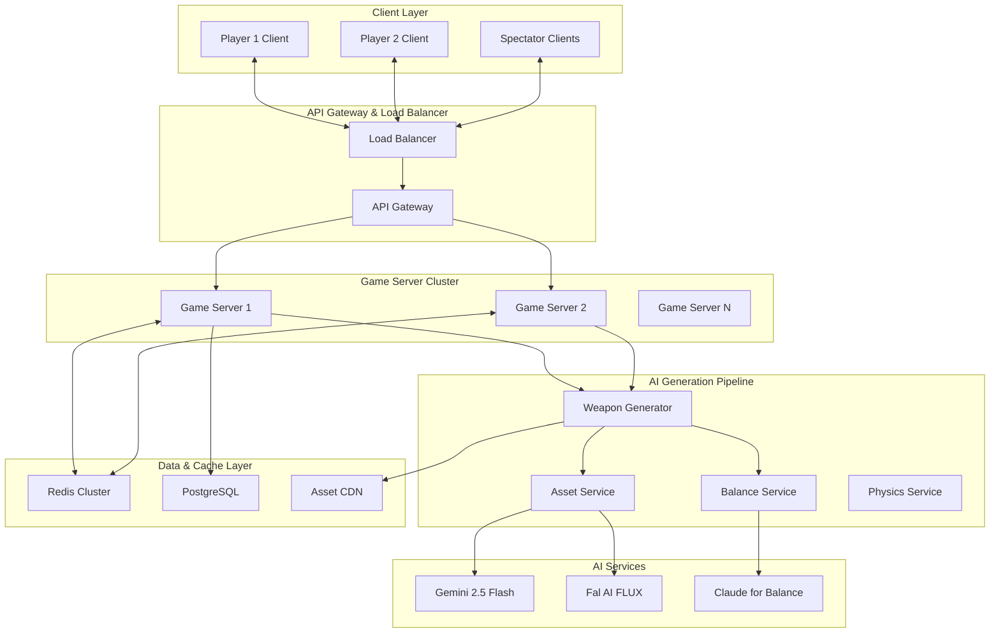

# Pixel-Forge PvP: Real-Time AI Combat Architecture
## Comprehensive Technical Design for Revolutionary Multiplayer System

### System Overview



## Core Architecture Principles

### 1. **Authoritative Server Design**
- Game server maintains single source of truth
- Client prediction with server reconciliation
- Rollback networking for smooth gameplay

### 2. **Microservice Architecture**
- Weapon Generation Service (independent scaling)
- Game Logic Service (combat simulation)
- Asset Management Service (CDN integration)
- Balance Service (AI-powered weapon evaluation)

### 3. **Edge-First Design**
- Regional game servers for low latency
- CDN for instant asset delivery
- Client-side prediction for responsiveness

## Detailed Component Architecture

### Game Server Core Engine

```python
class PvPGameServer:
    """
    Authoritative game server handling real-time combat
    """
    
    def __init__(self):
        self.matches: Dict[str, Match] = {}
        self.physics_engine = PhysicsEngine(tick_rate=60)
        self.weapon_service = WeaponGenerationService()
        self.balance_service = BalanceService()
        self.network_manager = NetworkManager()
        
    async def start_match(self, player1: Player, player2: Player) -> Match:
        match = Match(
            id=generate_match_id(),
            players=[player1, player2],
            arena=self.generate_arena(),
            physics=PhysicsConfig(),
            weapon_cooldowns={player1.id: 0, player2.id: 0}
        )
        
        self.matches[match.id] = match
        await self.broadcast_match_start(match)
        
        return match
    
    async def handle_weapon_request(self, match_id: str, player_id: str, prompt: str):
        """
        Critical path: Must complete in <3 seconds
        """
        match = self.matches[match_id]
        
        # Check cooldown
        if not self.can_generate_weapon(match, player_id):
            return {"error": "Weapon on cooldown"}
        
        # Validate prompt
        if not self.validate_prompt(prompt):
            return {"error": "Invalid prompt"}
        
        # Generate weapon (async, non-blocking)
        weapon_task = asyncio.create_task(
            self.weapon_service.generate_weapon(prompt, match.physics)
        )
        
        # Set cooldown immediately
        self.set_weapon_cooldown(match, player_id)
        
        # Wait for generation with timeout
        try:
            weapon = await asyncio.wait_for(weapon_task, timeout=3.0)
            
            # Balance check
            if not self.balance_service.is_balanced(weapon, match.context):
                weapon = self.balance_service.apply_nerfs(weapon)
            
            # Add to match state
            self.add_weapon_to_player(match, player_id, weapon)
            
            # Broadcast to all clients
            await self.broadcast_weapon_created(match.id, player_id, weapon)
            
            return {"success": True, "weapon": weapon}
            
        except asyncio.TimeoutError:
            return {"error": "Generation timeout"}
    
    async def apply_master_prompt(self, match_id: str, master_prompt: str):
        """
        Modify physics/rules in real-time
        """
        match = self.matches[match_id]
        
        # Parse master prompt
        physics_mods = await self.parse_master_prompt(master_prompt)
        
        # Apply modifications
        old_physics = match.physics.copy()
        match.physics.apply_modifications(physics_mods)
        
        # Broadcast change
        await self.broadcast_physics_change(match_id, physics_mods, duration=15)
        
        # Schedule revert
        asyncio.create_task(
            self.revert_physics_after_delay(match_id, old_physics, 15)
        )
    
    def physics_tick(self, match: Match):
        """
        60Hz physics simulation
        """
        # Update all physics objects
        for player in match.players:
            self.physics_engine.update_player(player, match.physics)
            
        for projectile in match.projectiles:
            self.physics_engine.update_projectile(projectile, match.physics)
            
        # Check collisions
        collisions = self.physics_engine.detect_collisions(match)
        
        for collision in collisions:
            self.handle_collision(match, collision)
        
        # Broadcast state to clients
        self.broadcast_game_state(match)
```

### Weapon Generation Pipeline

```python
class WeaponGenerationService:
    """
    High-performance weapon generation with caching and fallbacks
    """
    
    def __init__(self):
        self.gemini = GeminiClient()
        self.fal = FalClient() 
        self.cache = RedisCache()
        self.balance_ai = BalanceAI()
        
        # Pre-generated weapon templates
        self.weapon_templates = WeaponTemplateLibrary()
        
    async def generate_weapon(self, prompt: str, physics: PhysicsConfig) -> Weapon:
        """
        Multi-tier generation strategy for <3s response time
        """
        
        # Tier 1: Exact cache hit
        cache_key = f"weapon:{hash(prompt)}:{physics.hash()}"
        cached = await self.cache.get(cache_key)
        if cached:
            return self.deserialize_weapon(cached)
        
        # Tier 2: Template-based rapid generation
        template_match = self.weapon_templates.find_match(prompt)
        if template_match and template_match.confidence > 0.8:
            weapon = await self.generate_from_template(template_match, prompt)
            await self.cache.set(cache_key, weapon, ttl=3600)
            return weapon
        
        # Tier 3: Full AI generation with parallel processing
        tasks = [
            self.generate_with_gemini(prompt),
            self.generate_with_fal(prompt),  # Backup
        ]
        
        # Race condition: first to complete wins
        done, pending = await asyncio.wait(
            tasks, 
            return_when=asyncio.FIRST_COMPLETED,
            timeout=2.5
        )
        
        # Cancel pending tasks
        for task in pending:
            task.cancel()
        
        if done:
            weapon = await done.pop()
            weapon = self.apply_physics_properties(weapon, physics)
            weapon = await self.balance_weapon(weapon)
            
            await self.cache.set(cache_key, weapon, ttl=3600)
            return weapon
        
        # Tier 4: Emergency fallback
        return self.weapon_templates.get_fallback_weapon(prompt)
    
    async def generate_with_gemini(self, prompt: str) -> Weapon:
        """
        Primary generation using Gemini 2.5 Flash
        """
        optimized_prompt = f"""
        Create a 2D game weapon sprite and stats for: "{prompt}"
        
        Requirements:
        - 64x64 pixel sprite, pixel art style
        - Transparent background
        - Suitable for PvP combat game
        - Balanced damage/speed/range stats
        - Unique visual design
        
        Style: 16-bit pixel art, vibrant colors, clear silhouette
        Output: Single weapon sprite, game-ready
        """
        
        try:
            # Generate sprite
            sprite_response = await self.gemini.generate_image(optimized_prompt)
            
            # Generate stats using separate AI call
            stats_prompt = f"""
            Generate balanced game stats for weapon: "{prompt}"
            
            Return JSON format:
            {{
                "damage": 10-100,
                "speed": 10-100, 
                "range": 10-100,
                "ammo": 1-30,
                "cooldown": 1000-5000,
                "special_effect": "description"
            }}
            
            Balance for PvP combat, prevent overpowered combinations.
            """
            
            stats_response = await self.gemini.generate_text(stats_prompt)
            stats = json.loads(stats_response)
            
            weapon = Weapon(
                id=generate_uuid(),
                name=prompt,
                sprite_url=sprite_response.url,
                properties=WeaponProperties(**stats),
                generated_at=time.time()
            )
            
            return weapon
            
        except Exception as e:
            raise WeaponGenerationError(f"Gemini generation failed: {e}")
    
    async def balance_weapon(self, weapon: Weapon) -> Weapon:
        """
        AI-powered weapon balancing to prevent exploits
        """
        balance_score = await self.balance_ai.evaluate_weapon(weapon)
        
        if balance_score > 85:  # Too powerful
            weapon = self.apply_balance_nerfs(weapon)
        elif balance_score < 15:  # Too weak
            weapon = self.apply_balance_buffs(weapon)
        
        return weapon
    
    def apply_balance_nerfs(self, weapon: Weapon) -> Weapon:
        """
        Reduce weapon effectiveness while maintaining character
        """
        # Reduce damage but increase utility
        weapon.properties.damage = int(weapon.properties.damage * 0.7)
        weapon.properties.cooldown = int(weapon.properties.cooldown * 1.3)
        
        # Add drawbacks
        if weapon.properties.range > 80:
            weapon.properties.ammo = max(1, weapon.properties.ammo // 2)
        
        return weapon
```

### Real-Time Networking Architecture

```python
class NetworkManager:
    """
    Authoritative server with client prediction and rollback
    """
    
    def __init__(self):
        self.tick_rate = 60  # Server simulation rate
        self.client_update_rate = 30  # Client update frequency
        self.rollback_buffer_size = 60  # 1 second of history
        
    async def handle_client_input(self, match_id: str, player_id: str, input_data: dict):
        """
        Process client input with timestamp validation
        """
        match = self.get_match(match_id)
        
        # Validate input timestamp
        server_time = time.time()
        client_time = input_data['timestamp']
        
        if abs(server_time - client_time) > 0.1:  # 100ms tolerance
            # Input too old, discard
            return
        
        # Apply input to simulation
        self.apply_player_input(match, player_id, input_data)
        
        # Check if rollback needed (conflicting client predictions)
        if self.needs_rollback(match, input_data):
            await self.perform_rollback(match, client_time)
    
    async def broadcast_game_state(self, match: Match):
        """
        Send authoritative game state to all clients
        """
        state = GameState(
            timestamp=time.time(),
            players={p.id: p.get_network_state() for p in match.players},
            projectiles=[proj.get_network_state() for proj in match.projectiles],
            physics=match.physics.get_network_state(),
            match_events=match.get_recent_events()
        )
        
        # Send to all connected clients
        for player in match.players:
            await self.send_to_client(player.connection, state)
        
        # Store for rollback
        self.store_game_state(match.id, state)
    
    async def perform_rollback(self, match: Match, rollback_time: float):
        """
        Rollback and replay system for smooth gameplay
        """
        # Find historical state
        historical_state = self.get_historical_state(match.id, rollback_time)
        
        # Restore match state
        match.restore_state(historical_state)
        
        # Replay all inputs since rollback time
        inputs_to_replay = self.get_inputs_since(match.id, rollback_time)
        
        for input_data in inputs_to_replay:
            self.apply_player_input(match, input_data['player_id'], input_data)
        
        # Broadcast corrected state
        await self.broadcast_game_state(match)
```

### Physics Engine with Dynamic Modifications

```python
class DynamicPhysicsEngine:
    """
    Physics engine that can modify rules in real-time
    """
    
    def __init__(self):
        self.base_config = PhysicsConfig()
        self.active_modifications = []
        
    def apply_master_prompt(self, modification: PhysicsMod, duration: float):
        """
        Apply physics modification with automatic revert
        """
        self.active_modifications.append({
            'mod': modification,
            'expires_at': time.time() + duration
        })
        
        self.recalculate_physics()
    
    def recalculate_physics(self):
        """
        Combine base physics with all active modifications
        """
        self.current_config = self.base_config.copy()
        
        for mod_data in self.active_modifications:
            mod = mod_data['mod']
            
            if mod.type == 'gravity':
                self.current_config.gravity *= mod.multiplier
            elif mod.type == 'friction':
                self.current_config.friction *= mod.multiplier
            elif mod.type == 'bounce':
                self.current_config.restitution *= mod.multiplier
        
        # Update all physics objects
        self.apply_config_to_objects()
    
    def update_projectile(self, projectile: Projectile):
        """
        Update projectile with current physics
        """
        # Apply gravity
        projectile.velocity.y += self.current_config.gravity * self.dt
        
        # Apply air resistance
        drag = self.current_config.air_resistance
        projectile.velocity *= (1 - drag)
        
        # Update position
        projectile.position += projectile.velocity * self.dt
        
        # Handle weapon-specific physics
        if hasattr(projectile.weapon, 'physics_override'):
            self.apply_weapon_physics(projectile)
    
    def detect_weapon_collisions(self, match: Match) -> List[Collision]:
        """
        Advanced collision detection for generated weapons
        """
        collisions = []
        
        for projectile in match.projectiles:
            for player in match.players:
                if self.check_collision(projectile, player):
                    collision = Collision(
                        projectile=projectile,
                        target=player,
                        damage=self.calculate_damage(projectile.weapon, player),
                        effects=projectile.weapon.special_effects
                    )
                    collisions.append(collision)
        
        return collisions
    
    def calculate_damage(self, weapon: Weapon, target: Player) -> int:
        """
        Dynamic damage calculation based on weapon properties
        """
        base_damage = weapon.properties.damage
        
        # Apply physics modifications
        damage_multiplier = 1.0
        
        for mod in self.active_modifications:
            if mod['mod'].type == 'damage_boost':
                damage_multiplier *= mod['mod'].multiplier
        
        # Apply weapon-specific calculations
        if weapon.properties.special_effect == 'armor_piercing':
            damage_multiplier *= 1.5
        elif weapon.properties.special_effect == 'area_damage':
            # Calculate area damage
            distance = self.calculate_distance(weapon.position, target.position)
            if distance < weapon.properties.effect_radius:
                damage_multiplier *= (1 - distance / weapon.properties.effect_radius)
        
        return int(base_damage * damage_multiplier)
```

## Infrastructure Architecture

### Deployment Strategy

```yaml
# Kubernetes deployment for auto-scaling
apiVersion: apps/v1
kind: Deployment
metadata:
  name: game-servers
spec:
  replicas: 5
  selector:
    matchLabels:
      app: game-server
  template:
    spec:
      containers:
      - name: game-server
        image: pixelforge/game-server:latest
        resources:
          requests:
            memory: "512Mi"
            cpu: "500m"
          limits:
            memory: "1Gi"  
            cpu: "1000m"
        env:
        - name: MAX_CONCURRENT_MATCHES
          value: "10"
        - name: TICK_RATE
          value: "60"
        ports:
        - containerPort: 8080
          name: websocket
        - containerPort: 8090
          name: http
---
apiVersion: apps/v1
kind: Deployment  
metadata:
  name: weapon-generators
spec:
  replicas: 3
  selector:
    matchLabels:
      app: weapon-generator
  template:
    spec:
      containers:
      - name: weapon-generator
        image: pixelforge/weapon-gen:latest
        resources:
          requests:
            memory: "1Gi"
            cpu: "1000m" 
          limits:
            memory: "2Gi"
            cpu: "2000m"
        env:
        - name: GEMINI_API_KEY
          valueFrom:
            secretKeyRef:
              name: api-keys
              key: gemini
        - name: FAL_API_KEY
          valueFrom:
            secretKeyRef:
              name: api-keys
              key: fal
```

### Data Architecture

```sql
-- PostgreSQL schema for PvP system
CREATE TABLE matches (
    id UUID PRIMARY KEY DEFAULT gen_random_uuid(),
    created_at TIMESTAMP DEFAULT NOW(),
    status VARCHAR(20) DEFAULT 'active',
    player1_id UUID REFERENCES users(id),
    player2_id UUID REFERENCES users(id),
    winner_id UUID REFERENCES users(id),
    duration_seconds INTEGER,
    total_weapons_generated INTEGER,
    match_data JSONB  -- Full match replay data
);

CREATE TABLE weapons (
    id UUID PRIMARY KEY DEFAULT gen_random_uuid(),
    prompt TEXT NOT NULL,
    sprite_url TEXT,
    properties JSONB,
    balance_score INTEGER,
    usage_count INTEGER DEFAULT 0,
    created_at TIMESTAMP DEFAULT NOW(),
    creator_id UUID REFERENCES users(id)
);

CREATE TABLE match_events (
    id UUID PRIMARY KEY DEFAULT gen_random_uuid(),
    match_id UUID REFERENCES matches(id),
    timestamp TIMESTAMP DEFAULT NOW(),
    event_type VARCHAR(50),
    player_id UUID,
    event_data JSONB
);

-- Indexes for performance
CREATE INDEX idx_matches_active ON matches(status, created_at DESC);
CREATE INDEX idx_weapons_prompt ON weapons USING gin(to_tsvector('english', prompt));
CREATE INDEX idx_match_events_match ON match_events(match_id, timestamp);
```

### Caching Strategy

```python
class CacheManager:
    """
    Multi-tier caching for optimal performance
    """
    
    def __init__(self):
        self.local_cache = {}  # L1: In-memory (weapon templates)
        self.redis = Redis()   # L2: Shared cache (generated weapons)
        self.cdn = CloudFlare()  # L3: Asset delivery (sprites)
    
    async def get_weapon(self, prompt_hash: str) -> Optional[Weapon]:
        # L1: Check local template cache
        if prompt_hash in self.local_cache:
            return self.local_cache[prompt_hash]
        
        # L2: Check Redis for generated weapons
        cached_weapon = await self.redis.get(f"weapon:{prompt_hash}")
        if cached_weapon:
            weapon = Weapon.deserialize(cached_weapon)
            self.local_cache[prompt_hash] = weapon
            return weapon
        
        return None
    
    async def store_weapon(self, weapon: Weapon):
        # Store in all cache tiers
        prompt_hash = hash(weapon.prompt)
        
        # L1: Local cache
        self.local_cache[prompt_hash] = weapon
        
        # L2: Redis with TTL
        await self.redis.setex(
            f"weapon:{prompt_hash}",
            3600,  # 1 hour
            weapon.serialize()
        )
        
        # L3: CDN for sprite
        if weapon.sprite_url:
            await self.cdn.cache_asset(weapon.sprite_url)
```

## Performance Optimizations

### Client-Side Predictions

```javascript
// Client-side prediction for responsive gameplay
class ClientGameState {
    constructor() {
        this.predictedState = new GameState();
        this.confirmedState = new GameState();
        this.inputBuffer = [];
    }
    
    predictPlayerMovement(input) {
        // Apply input immediately for responsiveness
        this.predictedState.applyInput(input);
        
        // Store input for server reconciliation
        this.inputBuffer.push({
            input: input,
            timestamp: Date.now(),
            sequenceNumber: this.getNextSequence()
        });
        
        // Send to server
        this.sendInputToServer(input);
    }
    
    reconcileWithServer(serverState) {
        // Check if prediction was correct
        if (this.predictedState.matches(serverState)) {
            // Prediction was correct, continue
            this.confirmedState = serverState;
            return;
        }
        
        // Prediction was wrong, rollback and replay
        this.rollbackAndReplay(serverState);
    }
    
    rollbackAndReplay(serverState) {
        // Start from authoritative server state
        this.confirmedState = serverState;
        
        // Replay all unconfirmed inputs
        const unconfirmedInputs = this.inputBuffer.filter(
            input => input.timestamp > serverState.timestamp
        );
        
        this.predictedState = this.confirmedState.copy();
        
        for (const input of unconfirmedInputs) {
            this.predictedState.applyInput(input.input);
        }
    }
}
```

### Weapon Generation Optimization

```python
class OptimizedWeaponGenerator:
    """
    High-performance weapon generation with multiple optimization strategies
    """
    
    def __init__(self):
        self.generation_queue = asyncio.Queue(maxsize=100)
        self.worker_pool = []
        self.template_matcher = SemanticTemplateMatcher()
        
        # Start worker processes
        for i in range(4):
            worker = asyncio.create_task(self.generation_worker())
            self.worker_pool.append(worker)
    
    async def generation_worker(self):
        """
        Worker process for background weapon generation
        """
        while True:
            try:
                request = await self.generation_queue.get()
                weapon = await self.generate_weapon_internal(request)
                request.future.set_result(weapon)
                
            except Exception as e:
                request.future.set_exception(e)
    
    async def generate_weapon_fast(self, prompt: str) -> Weapon:
        """
        Fast weapon generation with multiple optimization strategies
        """
        
        # Strategy 1: Semantic template matching
        template_match = await self.template_matcher.find_best_match(prompt)
        if template_match.confidence > 0.9:
            return self.generate_from_template(template_match, prompt)
        
        # Strategy 2: Prompt preprocessing and caching
        processed_prompt = self.preprocess_prompt(prompt)
        cache_key = f"weapon:v2:{hash(processed_prompt)}"
        
        cached = await self.redis.get(cache_key)
        if cached:
            return Weapon.deserialize(cached)
        
        # Strategy 3: Parallel generation with racing
        generation_future = asyncio.Future()
        request = WeaponGenerationRequest(
            prompt=processed_prompt,
            future=generation_future,
            priority=1
        )
        
        await self.generation_queue.put(request)
        
        # Wait for result with timeout
        try:
            weapon = await asyncio.wait_for(generation_future, timeout=2.8)
            await self.redis.setex(cache_key, 3600, weapon.serialize())
            return weapon
            
        except asyncio.TimeoutError:
            # Emergency fallback
            return self.template_matcher.get_emergency_fallback(prompt)
    
    def preprocess_prompt(self, prompt: str) -> str:
        """
        Optimize prompts for faster and more consistent generation
        """
        # Normalize synonyms
        synonyms = {
            'gun': 'rifle',
            'blade': 'sword',
            'bomb': 'explosive'
        }
        
        words = prompt.lower().split()
        normalized_words = [synonyms.get(word, word) for word in words]
        
        # Add style consistency
        style_suffix = " | pixel art style, 64x64, game weapon sprite"
        
        return " ".join(normalized_words) + style_suffix
```

## Security Architecture

### Anti-Cheat System

```python
class AntiCheatSystem:
    """
    Prevent cheating in real-time PvP matches
    """
    
    def __init__(self):
        self.movement_analyzer = MovementPatternAnalyzer()
        self.weapon_abuse_detector = WeaponAbuseDetector()
        self.timing_validator = TimingValidator()
    
    async def validate_player_action(self, match: Match, player_id: str, action: dict) -> bool:
        """
        Validate player actions for cheating
        """
        player = match.get_player(player_id)
        
        # Check movement patterns
        if action['type'] == 'movement':
            if not self.movement_analyzer.is_movement_possible(player, action):
                await self.flag_suspicious_activity(
                    player_id, 
                    'impossible_movement', 
                    action
                )
                return False
        
        # Check weapon generation timing
        elif action['type'] == 'generate_weapon':
            if not self.timing_validator.is_generation_allowed(player):
                await self.flag_suspicious_activity(
                    player_id,
                    'cooldown_violation',
                    action
                )
                return False
        
        # Check weapon properties abuse
        elif action['type'] == 'use_weapon':
            if self.weapon_abuse_detector.detect_manipulation(action['weapon']):
                await self.flag_suspicious_activity(
                    player_id,
                    'weapon_manipulation',
                    action
                )
                return False
        
        return True
    
    async def flag_suspicious_activity(self, player_id: str, violation_type: str, data: dict):
        """
        Handle detected cheating attempts
        """
        # Log for analysis
        await self.log_violation(player_id, violation_type, data)
        
        # Apply immediate consequences
        if violation_type == 'weapon_manipulation':
            # Reset weapon to last valid state
            await self.reset_player_weapon(player_id)
        elif violation_type == 'impossible_movement':
            # Teleport player to last valid position
            await self.correct_player_position(player_id)
        
        # Accumulate violations for potential ban
        violation_count = await self.increment_violation_count(player_id)
        if violation_count > 3:
            await self.temporary_ban_player(player_id, duration=3600)
```

### Content Moderation

```python
class WeaponContentModerator:
    """
    Ensure generated weapons are appropriate for all audiences
    """
    
    def __init__(self):
        self.inappropriate_terms = self.load_blocked_terms()
        self.ai_content_filter = ContentFilter()
    
    async def validate_weapon_prompt(self, prompt: str) -> bool:
        """
        Check if weapon prompt is appropriate
        """
        # Check against blocked terms
        prompt_lower = prompt.lower()
        for term in self.inappropriate_terms:
            if term in prompt_lower:
                return False
        
        # AI-based content moderation
        moderation_result = await self.ai_content_filter.analyze(prompt)
        
        if moderation_result.contains_violence_beyond_cartoon:
            return False
        if moderation_result.contains_inappropriate_content:
            return False
        
        return True
    
    async def validate_generated_weapon(self, weapon: Weapon) -> bool:
        """
        Check if generated weapon sprite is appropriate
        """
        # Image content analysis
        image_analysis = await self.ai_content_filter.analyze_image(
            weapon.sprite_url
        )
        
        # Check for inappropriate imagery
        if image_analysis.contains_real_weapons:
            return False
        if image_analysis.inappropriate_content_score > 0.7:
            return False
        
        return True
```

## Monitoring & Analytics

### Real-Time Performance Monitoring

```python
class PerformanceMonitor:
    """
    Monitor system performance and detect issues
    """
    
    def __init__(self):
        self.metrics = MetricsCollector()
        self.alerts = AlertSystem()
    
    def track_weapon_generation(self, duration: float, success: bool):
        """
        Track weapon generation performance
        """
        self.metrics.histogram('weapon_generation_duration', duration)
        self.metrics.counter('weapon_generation_total', tags={
            'status': 'success' if success else 'failure'
        })
        
        # Alert if generation time too high
        if duration > 3.0:
            self.alerts.send_alert(
                'weapon_generation_slow',
                f'Generation took {duration:.2f}s'
            )
    
    def track_match_performance(self, match: Match):
        """
        Track match performance metrics
        """
        self.metrics.gauge('active_matches', len(self.get_active_matches()))
        self.metrics.histogram('match_duration', match.duration)
        self.metrics.counter('weapons_generated_per_match', match.weapons_generated)
        
        # Network performance
        for player in match.players:
            self.metrics.histogram('player_latency', player.latency)
            self.metrics.counter('packets_sent', player.packets_sent)
            self.metrics.counter('packets_lost', player.packets_lost)
    
    async def generate_performance_report(self) -> dict:
        """
        Generate comprehensive performance report
        """
        return {
            'weapon_generation': {
                'avg_duration': self.metrics.get_avg('weapon_generation_duration'),
                'success_rate': self.metrics.get_rate('weapon_generation_total'),
                'p95_duration': self.metrics.get_percentile('weapon_generation_duration', 95)
            },
            'match_performance': {
                'active_matches': self.metrics.get_current('active_matches'),
                'avg_match_duration': self.metrics.get_avg('match_duration'),
                'avg_weapons_per_match': self.metrics.get_avg('weapons_generated_per_match')
            },
            'network_performance': {
                'avg_latency': self.metrics.get_avg('player_latency'),
                'packet_loss_rate': self.metrics.get_rate('packets_lost')
            }
        }
```

## Disaster Recovery & Failover

### Multi-Region Deployment

```yaml
# Global infrastructure setup
regions:
  us-west-2:
    game_servers: 10
    weapon_generators: 5
    redis_cluster: 3_nodes
    
  eu-west-1:
    game_servers: 8
    weapon_generators: 4
    redis_cluster: 3_nodes
    
  ap-southeast-1:
    game_servers: 6
    weapon_generators: 3
    redis_cluster: 3_nodes

failover_strategy:
  automatic_failover: true
  health_check_interval: 10s
  failover_threshold: 3_failed_checks
  cross_region_latency_max: 150ms
  
data_replication:
  weapon_cache: cross_region_async
  match_state: region_local_only
  user_data: global_sync
```

## Cost Optimization

### Resource Allocation Strategy

```python
class ResourceOptimizer:
    """
    Optimize resource allocation to minimize costs
    """
    
    def __init__(self):
        self.load_balancer = IntelligentLoadBalancer()
        self.scaler = AutoScaler()
    
    async def optimize_weapon_generation(self):
        """
        Optimize AI API usage to reduce costs
        """
        # Batch similar requests
        pending_requests = self.get_pending_weapon_requests()
        batched = self.batch_similar_prompts(pending_requests)
        
        for batch in batched:
            # Generate multiple weapons in single API call
            weapons = await self.gemini.generate_batch(batch.prompts)
            self.distribute_weapons_to_requests(batch.requests, weapons)
    
    async def scale_based_on_demand(self):
        """
        Auto-scale resources based on current demand
        """
        current_load = await self.get_current_load()
        
        if current_load.weapon_generation_queue > 50:
            # Scale up weapon generators
            await self.scaler.scale_service('weapon-generator', replicas=5)
        elif current_load.weapon_generation_queue < 10:
            # Scale down to save costs
            await self.scaler.scale_service('weapon-generator', replicas=2)
        
        if current_load.active_matches > 100:
            # Scale up game servers
            await self.scaler.scale_service('game-server', replicas=10)
        elif current_load.active_matches < 20:
            # Scale down during off-peak
            await self.scaler.scale_service('game-server', replicas=3)
```

This comprehensive architecture provides the foundation for a revolutionary real-time PvP game with AI-generated weapons. The system is designed for scalability, performance, and reliability while maintaining the creative freedom that makes the concept compelling.

### Next Steps for Implementation

1. **Proof of Concept**: Build minimal multiplayer server with basic weapon generation
2. **Performance Testing**: Validate 3-second weapon generation requirement
3. **Network Optimization**: Implement client prediction and rollback systems
4. **AI Integration**: Connect Gemini 2.5 Flash for weapon generation
5. **Balance System**: Implement AI-powered weapon balance evaluation

The technical complexity is high, but the potential to create an entirely new genre of competitive gaming makes this a worthwhile endeavor for the hackathon.