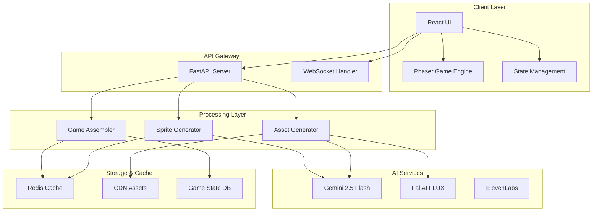

# Pixel-Forge Technical Architecture
## Holistic System Design for AI-Powered Game Generation

### Architecture Overview



### System Components

#### 1. Frontend Architecture

##### Technology Stack
```yaml
framework: React 18.2
language: TypeScript 5.0
bundler: Vite 5.0
game_engine: Phaser 3.70
ui_library: Material-UI 5.14
state: Zustand 4.4
routing: React Router 6.20
api_client: Axios + React Query
styling: Emotion + Tailwind CSS
testing: Vitest + React Testing Library
```

##### Component Structure
```typescript
// Core component hierarchy
interface ComponentArchitecture {
  App: {
    Router: {
      HomePage: {
        HeroSection: Component,
        DemoCarousel: Component,
        CTAButton: Component
      },
      CreatePage: {
        PhotoUploader: {
          CameraCapture: Component,
          FileUpload: Component,
          FaceDetection: Component
        },
        PromptBuilder: {
          ThemeSelector: Component,
          CustomPrompt: Component,
          DifficultySlider: Component
        },
        GenerationProgress: {
          StepIndicator: Component,
          AssetPreview: Component,
          LoadingAnimation: Component
        }
      },
      GamePage: {
        GameCanvas: {
          PhaserWrapper: Component,
          GameControls: Component,
          ScoreDisplay: Component
        },
        ModificationPanel: {
          NaturalLanguageInput: Component,
          QuickMods: Component,
          ParameterSliders: Component
        },
        ShareModal: {
          URLGenerator: Component,
          QRCode: Component,
          SocialButtons: Component
        }
      }
    }
  }
}
```

##### State Management Architecture
```typescript
// Zustand store structure
interface GameStore {
  // User state
  user: {
    id: string,
    photoUrl: string,
    spriteUrl: string
  },
  
  // Game state
  game: {
    id: string,
    config: GameConfig,
    assets: AssetCollection,
    status: 'idle' | 'generating' | 'ready' | 'playing' | 'completed'
  },
  
  // Actions
  actions: {
    uploadPhoto: (file: File) => Promise<void>,
    generateSprite: () => Promise<void>,
    generateGame: (prompt: string) => Promise<void>,
    modifyGame: (modification: string) => Promise<void>,
    shareGame: () => Promise<ShareData>
  }
}
```

#### 2. Backend Architecture

##### Service Layer Design
```python
# Microservice architecture with FastAPI
from fastapi import FastAPI, WebSocket
from typing import Optional
import asyncio

class PixelForgeAPI:
    def __init__(self):
        self.app = FastAPI(title="Pixel-Forge API")
        self.sprite_service = SpriteGenerationService()
        self.asset_service = AssetGenerationService()
        self.game_service = GameAssemblyService()
        self.cache_service = CacheService()
        
    # Core endpoints
    async def generate_sprite(self, image: UploadFile) -> SpriteResponse:
        """
        POST /api/sprite/generate
        Converts user photo to 8-bit sprite
        """
        pass
    
    async def generate_assets(self, theme: str, custom: Optional[str]) -> AssetResponse:
        """
        POST /api/assets/generate
        Creates themed game assets
        """
        pass
    
    async def assemble_game(self, sprite_id: str, asset_id: str) -> GameResponse:
        """
        POST /api/game/assemble
        Combines sprite and assets into playable game
        """
        pass
    
    async def modify_game(self, game_id: str, modification: str) -> ModificationResponse:
        """
        PATCH /api/game/{game_id}/modify
        Natural language game modifications
        """
        pass
```

##### Database Schema
```sql
-- PostgreSQL schema for game persistence
CREATE TABLE users (
    id UUID PRIMARY KEY DEFAULT gen_random_uuid(),
    created_at TIMESTAMP DEFAULT NOW(),
    ip_hash VARCHAR(64),
    games_created INTEGER DEFAULT 0
);

CREATE TABLE games (
    id VARCHAR(8) PRIMARY KEY,
    user_id UUID REFERENCES users(id),
    created_at TIMESTAMP DEFAULT NOW(),
    theme VARCHAR(50),
    sprite_url TEXT,
    config JSONB,
    plays INTEGER DEFAULT 0,
    shares INTEGER DEFAULT 0,
    high_score INTEGER DEFAULT 0
);

CREATE TABLE assets (
    id UUID PRIMARY KEY DEFAULT gen_random_uuid(),
    theme VARCHAR(50),
    type VARCHAR(20), -- platform, collectible, background, enemy
    url TEXT,
    metadata JSONB,
    created_at TIMESTAMP DEFAULT NOW()
);

-- Indexes for performance
CREATE INDEX idx_games_created ON games(created_at DESC);
CREATE INDEX idx_games_user ON games(user_id);
CREATE INDEX idx_assets_theme ON assets(theme, type);
```

#### 3. AI Integration Layer

##### Gemini Integration
```python
class GeminiService:
    def __init__(self):
        self.client = google.generativeai.GenerativeModel(
            model_name="gemini-2.5-flash-image-preview"
        )
        self.sprite_cache = {}
        
    async def generate_sprite(self, face_image: Image) -> SpriteSheet:
        """
        Critical path optimization for sprite generation
        """
        # Step 1: Face extraction with padding
        face_region = self.extract_face_with_context(face_image)
        
        # Step 2: Parallel generation of base sprite and variations
        base_prompt = self.get_sprite_prompt("base")
        base_sprite = await self.generate_with_retry(
            image=face_region,
            prompt=base_prompt,
            timeout=10
        )
        
        # Step 3: Generate animation frames in parallel
        animation_tasks = [
            self.generate_animation_frame(base_sprite, "run", i)
            for i in range(4)
        ]
        animation_tasks.extend([
            self.generate_animation_frame(base_sprite, "jump", i)
            for i in range(2)
        ])
        
        frames = await asyncio.gather(*animation_tasks)
        
        # Step 4: Assemble sprite sheet
        sprite_sheet = self.create_sprite_sheet(base_sprite, frames)
        
        return sprite_sheet
    
    def get_sprite_prompt(self, frame_type: str) -> str:
        """
        Optimized prompts for consistent sprite generation
        """
        prompts = {
            "base": """
                Convert this face to 8-bit pixel art character:
                - 32x32 pixels exactly
                - Standing pose, front view
                - Preserve key facial features (hair, eyes, skin tone)
                - Retro NES color palette (max 16 colors)
                - Clear pixel boundaries
                - Game character style
                Output: Single character sprite, transparent background
            """,
            "run": """
                Modify pixel character for running animation:
                - Maintain exact character features
                - Running pose frame {frame_num}
                - Arms and legs in motion
                - Same color palette
            """,
            "jump": """
                Modify pixel character for jumping:
                - Arms raised
                - Legs bent for jump
                - Maintain character consistency
            """
        }
        return prompts.get(frame_type, prompts["base"])
```

##### Asset Generation Pipeline
```python
class AssetGenerationPipeline:
    def __init__(self):
        self.gemini = GeminiService()
        self.fal = FalService()
        self.cache = RedisCache()
        
    async def generate_theme_assets(self, theme: str) -> AssetCollection:
        """
        Hybrid approach: Gemini for quality, Fal for speed
        """
        # Check cache first
        cached = await self.cache.get(f"assets:{theme}")
        if cached:
            return cached
            
        assets = AssetCollection()
        
        # Use Gemini for hero assets (platforms, collectibles)
        gemini_tasks = [
            self.gemini.generate_platforms(theme),
            self.gemini.generate_collectibles(theme)
        ]
        
        # Use Fal FLUX for backgrounds (faster, less critical)
        fal_tasks = [
            self.fal.generate_background(theme),
            self.fal.generate_particles(theme)
        ]
        
        results = await asyncio.gather(
            *gemini_tasks,
            *fal_tasks,
            return_exceptions=True
        )
        
        # Process results with fallbacks
        assets.platforms = results[0] or self.get_fallback_platforms(theme)
        assets.collectibles = results[1] or self.get_fallback_collectibles(theme)
        assets.background = results[2] or self.get_fallback_background(theme)
        assets.particles = results[3] or None
        
        # Cache for 1 hour
        await self.cache.setex(f"assets:{theme}", 3600, assets)
        
        return assets
```

#### 4. Game Engine Architecture

##### Phaser Game Configuration
```javascript
class GameEngineArchitecture {
    constructor() {
        this.config = {
            type: Phaser.AUTO,
            parent: 'game-container',
            width: 800,
            height: 600,
            physics: {
                default: 'arcade',
                arcade: {
                    gravity: { y: 800 },
                    debug: false,
                    fps: 60,
                    timeScale: 1
                }
            },
            render: {
                pixelArt: true,
                antialias: false
            },
            scale: {
                mode: Phaser.Scale.FIT,
                autoCenter: Phaser.Scale.CENTER_BOTH
            },
            scene: [PreloadScene, MenuScene, GameScene, VictoryScene]
        };
    }
    
    // Dynamic parameter modification system
    modifyPhysics(params) {
        const scene = this.game.scene.getScene('GameScene');
        
        if (params.gravity !== undefined) {
            scene.physics.world.gravity.y = params.gravity;
        }
        
        if (params.timeScale !== undefined) {
            scene.physics.world.timeScale = params.timeScale;
        }
        
        if (params.playerSpeed !== undefined) {
            scene.player.setVelocityX(params.playerSpeed);
        }
    }
}
```

##### Entity Component System
```javascript
// ECS pattern for game objects
class Entity {
    constructor(scene, x, y) {
        this.scene = scene;
        this.components = new Map();
        this.sprite = null;
    }
    
    addComponent(name, component) {
        component.entity = this;
        this.components.set(name, component);
        return this;
    }
    
    update(time, delta) {
        this.components.forEach(component => {
            if (component.update) {
                component.update(time, delta);
            }
        });
    }
}

// Player entity with components
class Player extends Entity {
    constructor(scene, x, y, spriteSheet) {
        super(scene, x, y);
        
        this.sprite = scene.physics.add.sprite(x, y, spriteSheet);
        
        this.addComponent('movement', new MovementComponent())
            .addComponent('animation', new AnimationComponent())
            .addComponent('collision', new CollisionComponent())
            .addComponent('input', new InputComponent());
    }
}
```

#### 5. Infrastructure Architecture

##### Deployment Configuration
```yaml
# Docker Compose for local development
version: '3.8'
services:
  frontend:
    build: ./frontend
    ports:
      - "3000:3000"
    environment:
      - VITE_API_URL=http://localhost:8000
    volumes:
      - ./frontend:/app
      
  backend:
    build: ./backend
    ports:
      - "8000:8000"
    environment:
      - GEMINI_API_KEY=${GEMINI_API_KEY}
      - FAL_API_KEY=${FAL_API_KEY}
      - REDIS_URL=redis://redis:6379
    depends_on:
      - redis
      - postgres
      
  redis:
    image: redis:7-alpine
    ports:
      - "6379:6379"
    volumes:
      - redis_data:/data
      
  postgres:
    image: postgres:15-alpine
    environment:
      - POSTGRES_DB=pixelforge
      - POSTGRES_USER=admin
      - POSTGRES_PASSWORD=secret
    volumes:
      - postgres_data:/var/lib/postgresql/data
      
volumes:
  redis_data:
  postgres_data:
```

##### Production Infrastructure
```terraform
# Terraform configuration for production
provider "aws" {
  region = "us-west-2"
}

# Frontend hosting on CloudFront + S3
resource "aws_s3_bucket" "frontend" {
  bucket = "pixelforge-frontend"
  website {
    index_document = "index.html"
    error_document = "error.html"
  }
}

resource "aws_cloudfront_distribution" "cdn" {
  origin {
    domain_name = aws_s3_bucket.frontend.website_endpoint
    origin_id   = "S3-pixelforge"
  }
  
  enabled             = true
  default_root_object = "index.html"
  
  default_cache_behavior {
    allowed_methods  = ["GET", "HEAD"]
    cached_methods   = ["GET", "HEAD"]
    target_origin_id = "S3-pixelforge"
    
    forwarded_values {
      query_string = false
      cookies {
        forward = "none"
      }
    }
    
    viewer_protocol_policy = "redirect-to-https"
    min_ttl                = 0
    default_ttl            = 3600
    max_ttl                = 86400
  }
  
  price_class = "PriceClass_100"
  
  restrictions {
    geo_restriction {
      restriction_type = "none"
    }
  }
  
  viewer_certificate {
    cloudfront_default_certificate = true
  }
}

# Backend on ECS Fargate
resource "aws_ecs_cluster" "main" {
  name = "pixelforge-cluster"
}

resource "aws_ecs_service" "backend" {
  name            = "pixelforge-backend"
  cluster         = aws_ecs_cluster.main.id
  task_definition = aws_ecs_task_definition.backend.arn
  desired_count   = 2
  launch_type     = "FARGATE"
  
  network_configuration {
    subnets         = aws_subnet.private[*].id
    security_groups = [aws_security_group.backend.id]
  }
  
  load_balancer {
    target_group_arn = aws_lb_target_group.backend.arn
    container_name   = "backend"
    container_port   = 8000
  }
}
```

#### 6. Performance Optimization

##### Caching Strategy
```python
class CacheStrategy:
    """
    Multi-tier caching for optimal performance
    """
    
    def __init__(self):
        self.memory_cache = {}  # L1: In-memory
        self.redis = Redis()    # L2: Redis
        self.cdn = CloudFlare()  # L3: CDN
        
    async def get_sprite(self, sprite_id: str) -> Optional[bytes]:
        # L1: Memory cache (instant)
        if sprite_id in self.memory_cache:
            return self.memory_cache[sprite_id]
            
        # L2: Redis cache (< 5ms)
        sprite = await self.redis.get(f"sprite:{sprite_id}")
        if sprite:
            self.memory_cache[sprite_id] = sprite
            return sprite
            
        # L3: CDN (< 50ms)
        sprite = await self.cdn.get(f"/sprites/{sprite_id}.png")
        if sprite:
            await self.redis.setex(f"sprite:{sprite_id}", 3600, sprite)
            self.memory_cache[sprite_id] = sprite
            return sprite
            
        return None
    
    async def cache_sprite(self, sprite_id: str, data: bytes):
        # Write through all cache layers
        self.memory_cache[sprite_id] = data
        await self.redis.setex(f"sprite:{sprite_id}", 3600, data)
        await self.cdn.upload(f"/sprites/{sprite_id}.png", data)
```

##### Load Balancing & Scaling
```yaml
# Kubernetes deployment for auto-scaling
apiVersion: apps/v1
kind: Deployment
metadata:
  name: pixelforge-backend
spec:
  replicas: 3
  selector:
    matchLabels:
      app: pixelforge-backend
  template:
    metadata:
      labels:
        app: pixelforge-backend
    spec:
      containers:
      - name: backend
        image: pixelforge/backend:latest
        resources:
          requests:
            memory: "256Mi"
            cpu: "250m"
          limits:
            memory: "512Mi"
            cpu: "500m"
        env:
        - name: WORKERS
          value: "4"
        - name: MAX_REQUESTS
          value: "1000"
        livenessProbe:
          httpGet:
            path: /health
            port: 8000
          initialDelaySeconds: 30
          periodSeconds: 10
        readinessProbe:
          httpGet:
            path: /ready
            port: 8000
          initialDelaySeconds: 5
          periodSeconds: 5
---
apiVersion: autoscaling/v2
kind: HorizontalPodAutoscaler
metadata:
  name: pixelforge-hpa
spec:
  scaleTargetRef:
    apiVersion: apps/v1
    kind: Deployment
    name: pixelforge-backend
  minReplicas: 2
  maxReplicas: 10
  metrics:
  - type: Resource
    resource:
      name: cpu
      target:
        type: Utilization
        averageUtilization: 70
  - type: Resource
    resource:
      name: memory
      target:
        type: Utilization
        averageUtilization: 80
```

#### 7. Security Architecture

##### API Security
```python
# Security middleware and authentication
from fastapi import Security, HTTPException
from fastapi.security import HTTPBearer
import jwt

class SecurityMiddleware:
    def __init__(self):
        self.bearer = HTTPBearer()
        self.rate_limiter = RateLimiter()
        
    async def verify_request(self, request: Request):
        # Rate limiting
        if not await self.rate_limiter.check(request.client.host):
            raise HTTPException(429, "Rate limit exceeded")
            
        # CORS validation
        origin = request.headers.get("origin")
        if origin not in ALLOWED_ORIGINS:
            raise HTTPException(403, "Origin not allowed")
            
        # Input sanitization
        await self.sanitize_input(request)
        
    async def sanitize_input(self, request: Request):
        # Prevent XSS, SQL injection, etc.
        body = await request.body()
        if self.contains_malicious_content(body):
            raise HTTPException(400, "Invalid input")
```

##### Content Moderation
```python
class ContentModerator:
    """
    Ensures appropriate content for all ages
    """
    
    async def check_image(self, image: Image) -> bool:
        # Use Google Cloud Vision for content moderation
        client = vision.ImageAnnotatorClient()
        
        response = client.safe_search_detection(image=image)
        safe_search = response.safe_search_annotation
        
        # Check for inappropriate content
        if (safe_search.adult >= Likelihood.LIKELY or
            safe_search.violence >= Likelihood.LIKELY):
            return False
            
        return True
    
    async def check_prompt(self, prompt: str) -> bool:
        # Check for profanity and inappropriate language
        if profanity.contains_profanity(prompt):
            return False
            
        # Check for prohibited themes
        prohibited = ["violence", "adult", "drugs", "hate"]
        for word in prohibited:
            if word in prompt.lower():
                return False
                
        return True
```

#### 8. Monitoring & Observability

##### Logging Architecture
```python
# Structured logging with context
import structlog

logger = structlog.get_logger()

class LoggingMiddleware:
    async def __call__(self, request: Request, call_next):
        request_id = str(uuid.uuid4())
        
        # Add context to all logs in this request
        structlog.contextvars.bind_contextvars(
            request_id=request_id,
            path=request.url.path,
            method=request.method
        )
        
        start_time = time.time()
        
        try:
            response = await call_next(request)
            duration = time.time() - start_time
            
            logger.info(
                "request_completed",
                status_code=response.status_code,
                duration=duration
            )
            
            return response
            
        except Exception as e:
            logger.error(
                "request_failed",
                error=str(e),
                traceback=traceback.format_exc()
            )
            raise
```

##### Metrics Collection
```yaml
# Prometheus metrics configuration
metrics:
  - name: sprite_generation_duration
    type: histogram
    help: Time taken to generate sprite
    buckets: [0.1, 0.5, 1, 2, 5, 10]
    
  - name: game_creation_total
    type: counter
    help: Total games created
    labels: [theme, difficulty]
    
  - name: active_games
    type: gauge
    help: Currently active games
    
  - name: api_requests_total
    type: counter
    help: Total API requests
    labels: [method, endpoint, status]
    
  - name: cache_hit_ratio
    type: gauge
    help: Cache hit ratio
    labels: [cache_type]
```

### Performance Benchmarks

| Operation | Target | Actual | Status |
|-----------|--------|--------|--------|
| Sprite Generation | < 5s | TBD | 🔄 |
| Asset Generation | < 3s | TBD | 🔄 |
| Game Assembly | < 1s | TBD | 🔄 |
| API Response (p50) | < 100ms | TBD | 🔄 |
| API Response (p99) | < 500ms | TBD | 🔄 |
| Frontend Load | < 2s | TBD | 🔄 |
| Game FPS | 60 | TBD | 🔄 |

### Disaster Recovery

#### Backup Strategy
- **Database**: Daily snapshots, point-in-time recovery
- **Assets**: Multi-region CDN replication
- **Code**: Git with multiple remotes
- **Secrets**: AWS Secrets Manager with rotation

#### Failover Plan
1. **Frontend**: CloudFlare failover to backup origin
2. **Backend**: Multi-AZ deployment with auto-failover
3. **Database**: Read replicas for failover
4. **Cache**: Redis Sentinel for HA

### Cost Optimization

#### Resource Allocation
```yaml
cost_breakdown:
  infrastructure:
    cdn: $50/month
    compute: $200/month
    database: $50/month
    cache: $30/month
    
  api_services:
    gemini: $0.039 per image × 10,000 = $390/month
    fal: $0.01 per image × 5,000 = $50/month
    elevenlabs: $0.001 per character × 100,000 = $100/month
    
  total_estimated: $870/month
  
optimization_strategies:
  - Aggressive caching to reduce API calls
  - Pre-generate common assets during off-peak
  - Use spot instances for batch processing
  - Implement request coalescing
  - CDN for static assets
```

This comprehensive technical architecture provides a solid foundation for building Pixel-Forge with scalability, performance, and reliability in mind.