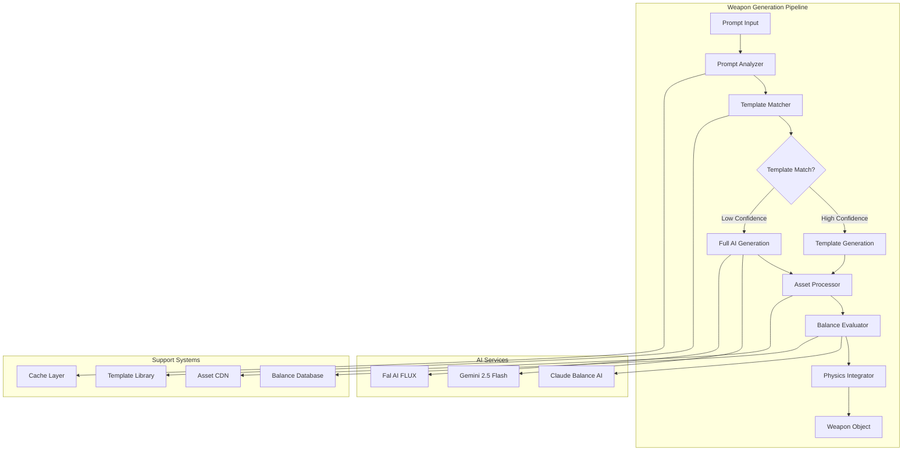

# Pixel-Forge: Revolutionary Weapon Generation System
## AI-Powered Real-Time Combat Weapon Creation

### System Overview

The weapon generation system is the heart of Pixel-Forge PvP, transforming natural language descriptions into balanced, visually compelling game weapons in under 3 seconds. This system must handle high concurrency while maintaining creative freedom and competitive balance.

### Core Components Architecture



## Prompt Analysis Engine

### Natural Language Understanding

```python
class PromptAnalyzer:
    """
    Advanced prompt analysis for weapon generation optimization
    """
    
    def __init__(self):
        self.nlp = spacy.load("en_core_web_sm")
        self.weapon_ontology = WeaponOntology()
        self.style_classifier = StyleClassifier()
        
    def analyze_prompt(self, prompt: str) -> PromptAnalysis:
        """
        Extract semantic meaning and generation hints from user prompt
        """
        doc = self.nlp(prompt)
        
        analysis = PromptAnalysis(
            original_prompt=prompt,
            weapon_category=self._extract_weapon_category(doc),
            materials=self._extract_materials(doc),
            effects=self._extract_effects(doc),
            style_hints=self._extract_style(doc),
            power_level=self._estimate_power_level(doc),
            complexity_score=self._calculate_complexity(doc)
        )
        
        return analysis
    
    def _extract_weapon_category(self, doc) -> WeaponCategory:
        """
        Identify the primary weapon category from prompt
        """
        category_keywords = {
            WeaponCategory.PROJECTILE: ['gun', 'rifle', 'bow', 'crossbow', 'launcher', 'cannon'],
            WeaponCategory.MELEE: ['sword', 'blade', 'axe', 'hammer', 'club', 'whip'],
            WeaponCategory.AREA_EFFECT: ['bomb', 'grenade', 'cloud', 'aura', 'field', 'zone'],
            WeaponCategory.UTILITY: ['shield', 'hook', 'rope', 'teleporter', 'barrier'],
            WeaponCategory.MAGIC: ['wand', 'staff', 'orb', 'crystal', 'spell', 'enchanted']
        }
        
        for token in doc:
            lemma = token.lemma_.lower()
            for category, keywords in category_keywords.items():
                if lemma in keywords:
                    return category
        
        # Default classification based on verb patterns
        if any(token.text.lower() in ['shoots', 'fires', 'launches'] for token in doc):
            return WeaponCategory.PROJECTILE
        elif any(token.text.lower() in ['swings', 'slashes', 'cuts'] for token in doc):
            return WeaponCategory.MELEE
        
        return WeaponCategory.PROJECTILE  # Default
    
    def _extract_materials(self, doc) -> List[Material]:
        """
        Extract material properties that affect weapon characteristics
        """
        material_map = {
            'fire': Material(name='fire', damage_mod=1.2, effect='burn'),
            'ice': Material(name='ice', speed_mod=0.8, effect='freeze'),
            'lightning': Material(name='lightning', speed_mod=1.5, effect='stun'),
            'poison': Material(name='poison', damage_mod=0.9, effect='poison_dot'),
            'crystal': Material(name='crystal', range_mod=1.3, effect='pierce'),
            'rubber': Material(name='rubber', bounce_mod=2.0, effect='bounce'),
            'metal': Material(name='metal', damage_mod=1.1, durability_mod=1.5),
            'wood': Material(name='wood', weight_mod=0.8, eco_friendly=True)
        }
        
        found_materials = []
        for token in doc:
            if token.lemma_.lower() in material_map:
                found_materials.append(material_map[token.lemma_.lower()])
        
        return found_materials
    
    def _extract_effects(self, doc) -> List[Effect]:
        """
        Identify special effects and abilities from prompt
        """
        effect_patterns = [
            (r'explod\w+', Effect('explosion', area_damage=True, radius=50)),
            (r'burn\w+|flame|fire', Effect('burn', damage_over_time=True, duration=3)),
            (r'freez\w+|ice|frost', Effect('freeze', movement_debuff=0.5, duration=2)),
            (r'bounc\w+', Effect('bounce', ricochet=True, max_bounces=3)),
            (r'pierce|penetrat\w+', Effect('pierce', armor_ignore=True)),
            (r'heal\w+', Effect('heal', restore_health=25)),
            (r'teleport', Effect('teleport', instant_movement=True)),
            (r'invisible|stealth', Effect('stealth', invisibility=True, duration=5))
        ]
        
        effects = []
        text = doc.text.lower()
        
        for pattern, effect in effect_patterns:
            if re.search(pattern, text):
                effects.append(effect)
        
        return effects
    
    def _estimate_power_level(self, doc) -> float:
        """
        Estimate intended power level for balance purposes
        """
        power_indicators = {
            'legendary': 0.95,
            'epic': 0.85,
            'super': 0.8,
            'mega': 0.75,
            'ultimate': 0.9,
            'divine': 0.95,
            'godly': 0.98,
            'massive': 0.7,
            'tiny': 0.2,
            'mini': 0.25,
            'weak': 0.15,
            'basic': 0.3
        }
        
        base_power = 0.5  # Neutral
        
        for token in doc:
            if token.lemma_.lower() in power_indicators:
                base_power = max(base_power, power_indicators[token.lemma_.lower()])
        
        # Adjust based on complexity
        complexity_bonus = min(0.2, len(doc) * 0.02)  # More complex = potentially stronger
        
        return min(1.0, base_power + complexity_bonus)

@dataclass
class PromptAnalysis:
    original_prompt: str
    weapon_category: WeaponCategory
    materials: List[Material]
    effects: List[Effect]
    style_hints: List[str]
    power_level: float
    complexity_score: float
    generation_strategy: str = "ai"  # "template" or "ai" or "hybrid"
```

## Template Matching System

### Semantic Weapon Templates

```python
class WeaponTemplateLibrary:
    """
    High-performance template matching for common weapon types
    """
    
    def __init__(self):
        self.templates = self._load_weapon_templates()
        self.embeddings = self._compute_template_embeddings()
        self.semantic_index = SemanticIndex()
        
    def _load_weapon_templates(self) -> Dict[str, WeaponTemplate]:
        """
        Load pre-designed weapon templates for rapid generation
        """
        return {
            "flame_sword": WeaponTemplate(
                name="Flame Sword",
                category=WeaponCategory.MELEE,
                base_sprite="sword_base.png",
                effect_overlay="fire_effect.png",
                properties=WeaponProperties(
                    damage=65, speed=70, range=40,
                    special_effect="burn_damage",
                    cooldown=2000
                ),
                variations=[
                    {"color_shift": "red_orange", "particle_effect": "fire_trail"},
                    {"size_scale": 1.2, "damage_mod": 1.1},
                    {"blade_shape": "curved", "speed_mod": 1.15}
                ]
            ),
            
            "ice_spear": WeaponTemplate(
                name="Ice Spear",
                category=WeaponCategory.PROJECTILE,
                base_sprite="spear_base.png", 
                effect_overlay="ice_crystal.png",
                properties=WeaponProperties(
                    damage=55, speed=85, range=120,
                    special_effect="freeze_target",
                    cooldown=1800
                ),
                physics_override=PhysicsOverride(
                    gravity_modifier=0.7,  # Ice spears float slightly
                    air_resistance=0.95,   # Smooth flight
                    penetration=True       # Can pierce armor
                )
            ),
            
            "thunder_hammer": WeaponTemplate(
                name="Thunder Hammer",
                category=WeaponCategory.MELEE,
                base_sprite="hammer_base.png",
                effect_overlay="lightning_effect.png",
                properties=WeaponProperties(
                    damage=80, speed=45, range=50,
                    special_effect="area_lightning",
                    cooldown=3000,
                    area_damage=True,
                    effect_radius=60
                ),
                sound_effects=["thunder_crack.wav", "electric_buzz.wav"]
            ),
            
            "poison_dagger": WeaponTemplate(
                name="Poison Dagger",
                category=WeaponCategory.MELEE,
                base_sprite="dagger_base.png",
                effect_overlay="poison_drip.png",
                properties=WeaponProperties(
                    damage=35, speed=95, range=25,
                    special_effect="poison_dot",
                    cooldown=1200,
                    dot_damage=15,
                    dot_duration=5
                ),
                balance_notes="High speed, low initial damage, strong DOT"
            ),
            
            "healing_orb": WeaponTemplate(
                name="Healing Orb",
                category=WeaponCategory.UTILITY,
                base_sprite="orb_base.png",
                effect_overlay="heal_aura.png",
                properties=WeaponProperties(
                    damage=0, speed=60, range=80,
                    special_effect="restore_health",
                    cooldown=4000,
                    heal_amount=40,
                    affects_allies=True
                ),
                balance_notes="Support weapon, no direct damage"
            ),
            
            "bouncing_bomb": WeaponTemplate(
                name="Bouncing Bomb",
                category=WeaponCategory.AREA_EFFECT,
                base_sprite="bomb_base.png",
                effect_overlay="fuse_spark.png",
                properties=WeaponProperties(
                    damage=70, speed=50, range=90,
                    special_effect="delayed_explosion",
                    cooldown=2500,
                    explosion_delay=2.0,
                    explosion_radius=80
                ),
                physics_override=PhysicsOverride(
                    bounce_count=3,
                    bounce_decay=0.7,
                    explode_on_timer=True
                )
            )
        }
    
    async def find_best_match(self, analysis: PromptAnalysis) -> TemplateMatch:
        """
        Find the best template match for given prompt analysis
        """
        # Compute prompt embedding
        prompt_embedding = await self.semantic_index.embed(analysis.original_prompt)
        
        best_match = None
        best_score = 0.0
        
        for template_name, template in self.templates.items():
            # Semantic similarity
            semantic_score = self._compute_semantic_similarity(
                prompt_embedding,
                self.embeddings[template_name]
            )
            
            # Category match bonus
            category_bonus = 0.2 if template.category == analysis.weapon_category else 0
            
            # Material compatibility
            material_bonus = self._compute_material_compatibility(
                analysis.materials,
                template.compatible_materials
            )
            
            # Effect alignment
            effect_bonus = self._compute_effect_alignment(
                analysis.effects,
                template.effects
            )
            
            total_score = (
                semantic_score * 0.4 +
                category_bonus +
                material_bonus * 0.2 +
                effect_bonus * 0.2
            )
            
            if total_score > best_score:
                best_score = total_score
                best_match = TemplateMatch(
                    template=template,
                    confidence=total_score,
                    adaptation_needed=self._compute_adaptations(analysis, template)
                )
        
        return best_match
    
    def generate_from_template(self, match: TemplateMatch, analysis: PromptAnalysis) -> Weapon:
        """
        Generate weapon from template with prompt-specific adaptations
        """
        template = match.template
        weapon = Weapon(
            id=generate_uuid(),
            name=self._generate_weapon_name(analysis.original_prompt),
            category=template.category,
            sprite_url=template.base_sprite,
            properties=template.properties.copy()
        )
        
        # Apply adaptations based on prompt analysis
        for adaptation in match.adaptation_needed:
            self._apply_adaptation(weapon, adaptation, analysis)
        
        # Apply material effects
        for material in analysis.materials:
            self._apply_material_effects(weapon, material)
        
        # Apply special effects
        for effect in analysis.effects:
            self._apply_special_effect(weapon, effect)
        
        # Balance adjustment based on power level
        if analysis.power_level > 0.7:
            weapon = self._apply_balance_nerf(weapon, analysis.power_level)
        elif analysis.power_level < 0.3:
            weapon = self._apply_balance_buff(weapon, analysis.power_level)
        
        weapon.generated_from = f"template:{template.name}"
        weapon.generation_time = time.time()
        
        return weapon
```

## AI-Powered Generation Pipeline

### Optimized Gemini Integration

```python
class GeminiWeaponGenerator:
    """
    High-performance Gemini 2.5 Flash integration for weapon generation
    """
    
    def __init__(self):
        self.client = genai.GenerativeModel('gemini-2.5-flash')
        self.prompt_optimizer = PromptOptimizer()
        self.generation_cache = GenerationCache()
        self.style_consistency = StyleConsistencyEngine()
        
    async def generate_weapon(self, analysis: PromptAnalysis) -> Weapon:
        """
        Generate complete weapon using Gemini 2.5 Flash
        """
        # Optimize prompt for consistent generation
        optimized_prompt = self.prompt_optimizer.optimize_for_weapons(analysis)
        
        # Check for cached generation
        cache_key = f"gemini:weapon:{hash(optimized_prompt)}"
        cached = await self.generation_cache.get(cache_key)
        if cached:
            return self._deserialize_weapon(cached)
        
        # Generate sprite and properties in parallel
        sprite_task = asyncio.create_task(
            self._generate_weapon_sprite(optimized_prompt, analysis)
        )
        properties_task = asyncio.create_task(
            self._generate_weapon_properties(optimized_prompt, analysis)
        )
        
        try:
            # Wait for both with timeout
            sprite_result, properties_result = await asyncio.wait_for(
                asyncio.gather(sprite_task, properties_task),
                timeout=2.5
            )
            
            # Combine results
            weapon = self._combine_generation_results(
                sprite_result,
                properties_result,
                analysis
            )
            
            # Cache result
            await self.generation_cache.set(cache_key, weapon, ttl=3600)
            
            return weapon
            
        except asyncio.TimeoutError:
            raise WeaponGenerationTimeoutError("Gemini generation exceeded 2.5s limit")
    
    async def _generate_weapon_sprite(self, prompt: str, analysis: PromptAnalysis) -> SpriteResult:
        """
        Generate weapon sprite with style consistency
        """
        sprite_prompt = f"""
        Create a 2D game weapon sprite for: "{analysis.original_prompt}"
        
        Technical Requirements:
        - Exactly 64x64 pixels
        - Pixel art style, 16-bit era
        - Transparent background (PNG)
        - Clear silhouette for gameplay visibility
        - Suitable for PvP combat game
        
        Style Guidelines:
        - Bold, saturated colors
        - Clear pixel boundaries (no anti-aliasing)
        - Maximum 32 colors
        - Consistent lighting (top-left light source)
        
        Weapon Category: {analysis.weapon_category.name}
        Materials: {', '.join([m.name for m in analysis.materials])}
        Effects: {', '.join([e.name for e in analysis.effects])}
        
        Create a visually striking, immediately recognizable weapon sprite.
        """
        
        response = await self.client.generate_content(sprite_prompt)
        
        # Process and validate sprite
        sprite_url = await self._process_sprite_response(response)
        
        return SpriteResult(
            url=sprite_url,
            generation_time=time.time(),
            prompt_used=sprite_prompt
        )
    
    async def _generate_weapon_properties(self, prompt: str, analysis: PromptAnalysis) -> PropertiesResult:
        """
        Generate balanced weapon properties using AI
        """
        properties_prompt = f"""
        Generate balanced game statistics for weapon: "{analysis.original_prompt}"
        
        Context:
        - PvP combat game with 100 HP players
        - Average match duration: 60-90 seconds
        - Fast-paced combat requiring skill and strategy
        - Weapon Category: {analysis.weapon_category.name}
        - Estimated Power Level: {analysis.power_level:.2f} (0.0-1.0 scale)
        
        Required JSON Output:
        {{
            "damage": <10-100 integer>,
            "speed": <10-100 integer>, 
            "range": <10-200 integer>,
            "ammo": <1-50 integer>,
            "cooldown": <1000-5000 integer (milliseconds)>,
            "special_effect": "<effect_name>",
            "effect_parameters": {{
                // Effect-specific parameters
            }},
            "balance_rationale": "<why these stats are balanced>"
        }}
        
        Balance Guidelines:
        - High damage weapons must have significant drawbacks (slow speed, long cooldown, limited ammo)
        - Fast weapons should have moderate damage
        - Long range weapons need reduced damage or slower projectiles
        - Special effects should not break game balance
        - Total "power budget" should not exceed player's power level expectation
        
        Consider materials: {', '.join([m.name for m in analysis.materials])}
        Consider effects: {', '.join([e.name for e in analysis.effects])}
        """
        
        response = await self.client.generate_content(properties_prompt)
        
        # Parse and validate properties
        properties_data = self._parse_properties_response(response)
        properties = WeaponProperties(**properties_data)
        
        return PropertiesResult(
            properties=properties,
            generation_time=time.time(),
            balance_score=self._calculate_balance_score(properties)
        )
    
    def _calculate_balance_score(self, properties: WeaponProperties) -> float:
        """
        Calculate balance score for generated weapon (0-100 scale)
        """
        # Define balance equations
        damage_weight = properties.damage / 100.0
        speed_weight = properties.speed / 100.0
        range_weight = properties.range / 200.0
        cooldown_penalty = (5000 - properties.cooldown) / 5000.0
        
        # Calculate raw power
        raw_power = (damage_weight * 0.4 + 
                    speed_weight * 0.3 + 
                    range_weight * 0.2 + 
                    cooldown_penalty * 0.1)
        
        # Adjust for special effects
        effect_multiplier = 1.0
        if properties.special_effect:
            effect_multipliers = {
                'burn_damage': 1.2,
                'freeze_target': 1.15,
                'area_damage': 1.3,
                'armor_piercing': 1.25,
                'healing': 0.5,  # Support weapons
                'teleport': 1.1
            }
            effect_multiplier = effect_multipliers.get(properties.special_effect, 1.0)
        
        balance_score = raw_power * effect_multiplier * 100
        
        return min(100, max(0, balance_score))
```

## Real-Time Balance System

### AI-Powered Weapon Balance

```python
class WeaponBalanceSystem:
    """
    Intelligent weapon balance system using AI evaluation
    """
    
    def __init__(self):
        self.balance_ai = BalanceAI()
        self.meta_analyzer = MetaAnalyzer()
        self.counter_generator = CounterWeaponGenerator()
        
    async def evaluate_weapon_balance(self, weapon: Weapon, match_context: MatchContext) -> BalanceEvaluation:
        """
        Comprehensive weapon balance evaluation
        """
        # Historical performance analysis
        historical_data = await self.get_weapon_performance_history(weapon.prompt_hash)
        
        # Current meta analysis
        meta_context = await self.meta_analyzer.get_current_meta()
        
        # AI-powered balance evaluation
        balance_prompt = f"""
        Evaluate the balance of this weapon in PvP combat:
        
        Weapon: {weapon.name}
        Properties: {weapon.properties}
        Historical Win Rate: {historical_data.win_rate:.2%}
        Usage Rate: {historical_data.usage_rate:.2%}
        Average Damage Per Match: {historical_data.avg_damage}
        
        Current Meta Context:
        - Top weapon categories: {meta_context.dominant_categories}
        - Average match duration: {meta_context.avg_match_duration}s
        - Player skill distribution: {meta_context.skill_distribution}
        
        Evaluate on 0-100 scale:
        - Overall balance score (50 = perfectly balanced)
        - Specific concerns (overpowered aspects)
        - Suggested adjustments
        - Counter-play options
        
        Return JSON format with detailed analysis.
        """
        
        balance_response = await self.balance_ai.evaluate(balance_prompt)
        evaluation = BalanceEvaluation.from_ai_response(balance_response)
        
        # Add automatic adjustments if needed
        if evaluation.balance_score > 75:  # Overpowered
            evaluation.suggested_nerfs = await self._generate_nerf_suggestions(weapon)
        elif evaluation.balance_score < 25:  # Underpowered
            evaluation.suggested_buffs = await self._generate_buff_suggestions(weapon)
        
        return evaluation
    
    async def apply_dynamic_balance(self, weapon: Weapon, match: Match) -> Weapon:
        """
        Apply real-time balance adjustments based on match context
        """
        balanced_weapon = weapon.copy()
        
        # Check for weapon spam (same weapon used repeatedly)
        weapon_usage = self._count_weapon_usage_in_match(weapon.prompt_hash, match)
        if weapon_usage > 3:
            # Apply spam penalty
            balanced_weapon.properties.cooldown *= 1.5
            balanced_weapon.balance_notes.append("Spam penalty applied")
        
        # Check for counter-weapon availability
        enemy_weapons = self._get_enemy_weapons(match, weapon.player_id)
        for enemy_weapon in enemy_weapons:
            if self._is_hard_counter(enemy_weapon, weapon):
                # Buff weapon slightly against hard counters
                balanced_weapon.properties.damage *= 1.1
                break
        
        # Apply match-length based adjustments
        if match.duration > 60:  # Long matches need more decisive weapons
            balanced_weapon.properties.damage *= 1.05
        
        return balanced_weapon
    
    async def suggest_counter_weapons(self, enemy_weapon: Weapon) -> List[CounterSuggestion]:
        """
        Suggest effective counter-weapons for given enemy weapon
        """
        counter_prompt = f"""
        Suggest effective counter-weapons for: {enemy_weapon.name}
        
        Enemy Weapon Properties:
        - Damage: {enemy_weapon.properties.damage}
        - Speed: {enemy_weapon.properties.speed}  
        - Range: {enemy_weapon.properties.range}
        - Special Effect: {enemy_weapon.properties.special_effect}
        
        Suggest 3 counter-weapon concepts that would be effective:
        1. Direct counter (exploit main weakness)
        2. Tactical counter (different approach)
        3. Meta counter (unexpected strategy)
        
        For each counter, provide:
        - Weapon concept (brief description)
        - Why it counters the enemy weapon
        - Approximate stats needed
        - Tactical usage notes
        """
        
        response = await self.balance_ai.generate_counters(counter_prompt)
        counters = self._parse_counter_suggestions(response)
        
        return counters
```

## Performance Optimization System

### Generation Performance Monitoring

```python
class WeaponGenerationProfiler:
    """
    Monitor and optimize weapon generation performance
    """
    
    def __init__(self):
        self.performance_tracker = PerformanceTracker()
        self.optimization_engine = OptimizationEngine()
        self.alerts = AlertSystem()
        
    async def profile_generation(self, prompt: str, generation_method: str) -> GenerationProfile:
        """
        Profile weapon generation performance
        """
        start_time = time.time()
        memory_start = psutil.Process().memory_info().rss
        
        try:
            # Perform generation with profiling
            if generation_method == 'template':
                result = await self._profile_template_generation(prompt)
            elif generation_method == 'ai':
                result = await self._profile_ai_generation(prompt)
            else:
                result = await self._profile_hybrid_generation(prompt)
            
            # Calculate metrics
            generation_time = time.time() - start_time
            memory_used = psutil.Process().memory_info().rss - memory_start
            
            profile = GenerationProfile(
                prompt=prompt,
                method=generation_method,
                generation_time=generation_time,
                memory_used=memory_used,
                success=True,
                result_quality=self._assess_quality(result)
            )
            
            # Track for optimization
            await self.performance_tracker.record_generation(profile)
            
            # Check for performance alerts
            if generation_time > 3.0:
                await self.alerts.send_alert(
                    'slow_generation',
                    f'Generation took {generation_time:.2f}s for prompt: {prompt[:50]}'
                )
            
            return profile
            
        except Exception as e:
            return GenerationProfile(
                prompt=prompt,
                method=generation_method,
                generation_time=time.time() - start_time,
                memory_used=0,
                success=False,
                error=str(e)
            )
    
    async def optimize_generation_pipeline(self):
        """
        Continuously optimize generation pipeline based on performance data
        """
        recent_profiles = await self.performance_tracker.get_recent_profiles(hours=1)
        
        # Analyze performance patterns
        slow_prompts = [p for p in recent_profiles if p.generation_time > 2.5]
        failed_generations = [p for p in recent_profiles if not p.success]
        
        # Optimize template matching
        if len(slow_prompts) > 10:
            await self._optimize_template_matching(slow_prompts)
        
        # Optimize AI prompt engineering
        if len(failed_generations) > 5:
            await self._optimize_ai_prompts(failed_generations)
        
        # Dynamic resource allocation
        current_load = len(recent_profiles)
        if current_load > 100:  # High load
            await self._scale_up_generation_workers()
        elif current_load < 20:  # Low load
            await self._scale_down_generation_workers()
    
    def _assess_quality(self, weapon: Weapon) -> float:
        """
        Assess the quality of generated weapon
        """
        quality_score = 0.0
        
        # Visual quality (sprite clarity, style consistency)
        if weapon.sprite_url:
            visual_score = self._assess_sprite_quality(weapon.sprite_url)
            quality_score += visual_score * 0.4
        
        # Balance quality (reasonable stats)
        balance_score = self._assess_balance_quality(weapon.properties)
        quality_score += balance_score * 0.3
        
        # Creativity score (unique vs generic)
        creativity_score = self._assess_creativity(weapon)
        quality_score += creativity_score * 0.3
        
        return quality_score
    
    def _assess_sprite_quality(self, sprite_url: str) -> float:
        """
        Assess visual quality of generated sprite
        """
        # Load and analyze sprite image
        image = self._load_sprite_image(sprite_url)
        
        quality_factors = []
        
        # Check resolution (should be 64x64)
        if image.size == (64, 64):
            quality_factors.append(1.0)
        else:
            quality_factors.append(0.5)
        
        # Check transparency (should have transparent background)
        if image.mode == 'RGBA' and self._has_transparent_background(image):
            quality_factors.append(1.0)
        else:
            quality_factors.append(0.3)
        
        # Check color count (pixel art should have limited colors)
        color_count = len(set(image.getdata()))
        if color_count <= 32:
            quality_factors.append(1.0)
        elif color_count <= 64:
            quality_factors.append(0.7)
        else:
            quality_factors.append(0.4)
        
        # Check for clear silhouette
        edge_clarity = self._assess_edge_clarity(image)
        quality_factors.append(edge_clarity)
        
        return sum(quality_factors) / len(quality_factors)
```

This comprehensive weapon generation system provides the foundation for creating unique, balanced weapons in real-time during PvP matches. The system is designed to maintain creativity while ensuring competitive integrity through intelligent balance systems and performance optimization.