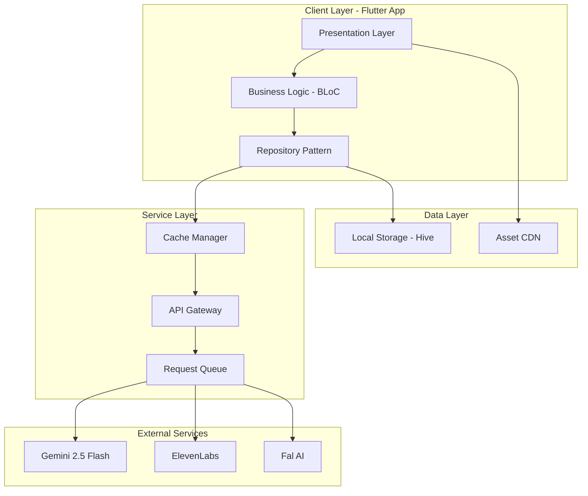

# Storybook AI - Technical Architecture Document
## Complete Implementation Blueprint for iOS (Flutter)

### Executive Technical Decision
**Framework: Flutter 3.24+** 
- Single codebase for iOS demo + Android port
- Native iOS performance via Impeller renderer
- Rich animation framework built-in
- Mature ecosystem for all requirements
- 12-hour hackathon timeline achievable

---

## 🏗️ System Architecture

### High-Level Architecture



---

## 📱 Flutter Project Structure

```
storybook_ai/
├── ios/                          # iOS specific configurations
│   ├── Runner/
│   │   ├── Info.plist           # iOS permissions & settings
│   │   └── Assets.xcassets      # iOS app icons
│   └── Podfile                  # iOS dependencies
│
├── lib/
│   ├── main.dart                # App entry point
│   ├── app.dart                 # App configuration
│   │
│   ├── core/                    # Core functionality
│   │   ├── constants/
│   │   │   ├── api_endpoints.dart
│   │   │   ├── story_templates.dart
│   │   │   └── character_prompts.dart
│   │   ├── errors/
│   │   │   ├── exceptions.dart
│   │   │   └── failures.dart
│   │   ├── services/
│   │   │   ├── api_service.dart
│   │   │   ├── cache_service.dart
│   │   │   └── connectivity_service.dart
│   │   └── utils/
│   │       ├── content_filter.dart
│   │       ├── prompt_builder.dart
│   │       └── audio_sync.dart
│   │
│   ├── data/                    # Data layer
│   │   ├── datasources/
│   │   │   ├── local/
│   │   │   │   └── story_local_datasource.dart
│   │   │   └── remote/
│   │   │       ├── gemini_datasource.dart
│   │   │       ├── elevenlabs_datasource.dart
│   │   │       └── fal_datasource.dart
│   │   ├── models/
│   │   │   ├── story_model.dart
│   │   │   ├── character_model.dart
│   │   │   └── page_model.dart
│   │   └── repositories/
│   │       └── story_repository_impl.dart
│   │
│   ├── domain/                  # Business logic
│   │   ├── entities/
│   │   │   ├── story.dart
│   │   │   ├── character.dart
│   │   │   └── story_page.dart
│   │   ├── repositories/
│   │   │   └── story_repository.dart
│   │   └── usecases/
│   │       ├── generate_story.dart
│   │       ├── save_story.dart
│   │       └── get_saved_stories.dart
│   │
│   └── presentation/            # UI layer
│       ├── blocs/
│       │   ├── story_generation/
│       │   ├── story_playback/
│       │   └── library/
│       ├── screens/
│       │   ├── home_screen.dart
│       │   ├── voice_input_screen.dart
│       │   ├── story_viewer_screen.dart
│       │   └── library_screen.dart
│       ├── widgets/
│       │   ├── animated_microphone.dart
│       │   ├── story_page_widget.dart
│       │   └── choice_overlay.dart
│       └── themes/
│           ├── app_theme.dart
│           └── night_mode_theme.dart
│
├── assets/                      # Static assets
│   ├── animations/             # Lottie animations
│   ├── fonts/                  # Custom fonts
│   ├── sounds/                 # UI sounds
│   └── images/                 # Fallback images
│
├── test/                       # Test files
└── pubspec.yaml               # Dependencies
```

---

## 🔧 Core Implementation Details

### 1. Character Consistency Engine

```dart
// character_consistency_engine.dart
import 'package:freezed_annotation/freezed_annotation.dart';

class CharacterConsistencyEngine {
  static const String CONSISTENCY_PROMPT_TEMPLATE = '''
    CRITICAL CONSISTENCY REQUIREMENTS:
    You must generate an image with these EXACT character details:
    
    Character Name: {name}
    
    PHYSICAL FEATURES (MUST MATCH EXACTLY):
    - Species/Type: {species}
    - Primary Color: {primaryColor} (EXACT shade: {colorHex})
    - Secondary Colors: {secondaryColors}
    - Size/Build: {size}
    - Distinctive Features: {features}
    - Clothing/Accessories: {accessories}
    
    POSE AND EXPRESSION:
    - Current Action: {action}
    - Facial Expression: {expression}
    - Body Position: {position}
    
    SCENE CONTEXT:
    - Setting: {setting}
    - Lighting: {lighting}
    - Other Elements: {elements}
    
    STYLE REQUIREMENTS:
    - Art Style: Soft, dreamlike children's book illustration
    - Color Palette: Warm and inviting
    - Perspective: {perspective}
    
    PREVIOUS APPEARANCES:
    The character appeared in previous images with these exact details:
    {previousDescriptions}
    
    CRITICAL: This character must look IDENTICAL to their previous appearances.
    Any deviation will break the story continuity.
  ''';
  
  final Map<String, CharacterProfile> _characterRegistry = {};
  final List<GeneratedImage> _imageHistory = [];
  
  Future<CharacterProfile> extractCharacterFromIdea(String childIdea) async {
    // Use Gemini to analyze the idea and extract character details
    final extractionPrompt = '''
      A child wants a story about: "$childIdea"
      
      Extract the main character details:
      1. Character type/species
      2. Name (generate if not provided)
      3. Physical appearance
      4. Personality traits
      5. Any mentioned accessories or clothing
      
      Format as JSON.
    ''';
    
    final response = await _geminiService.generateContent(extractionPrompt);
    return CharacterProfile.fromJson(response);
  }
  
  String buildConsistentPrompt(
    CharacterProfile character,
    String sceneDescription,
    int pageNumber,
  ) {
    // Get previous descriptions for consistency
    final previousDescriptions = _imageHistory
        .where((img) => img.characterId == character.id)
        .map((img) => img.characterDescription)
        .join('\n');
    
    return CONSISTENCY_PROMPT_TEMPLATE
        .replaceAll('{name}', character.name)
        .replaceAll('{species}', character.species)
        .replaceAll('{primaryColor}', character.primaryColor)
        .replaceAll('{colorHex}', character.colorHex)
        .replaceAll('{secondaryColors}', character.secondaryColors.join(', '))
        .replaceAll('{size}', character.size)
        .replaceAll('{features}', character.distinctiveFeatures.join(', '))
        .replaceAll('{accessories}', character.accessories.join(', '))
        .replaceAll('{action}', sceneDescription)
        .replaceAll('{previousDescriptions}', previousDescriptions);
  }
  
  Future<bool> validateConsistency(
    Uint8List generatedImage,
    CharacterProfile expectedCharacter,
  ) async {
    // Use Gemini's vision capabilities to verify character consistency
    final validationPrompt = '''
      Analyze this image and verify if the character matches these specifications:
      ${expectedCharacter.toDetailedDescription()}
      
      Return JSON with:
      - matches: boolean
      - confidence: 0-100
      - discrepancies: list of any differences
    ''';
    
    final validation = await _geminiService.analyzeImage(
      generatedImage,
      validationPrompt,
    );
    
    return validation['confidence'] > 85; // 85% match threshold
  }
}

@freezed
class CharacterProfile with _$CharacterProfile {
  const factory CharacterProfile({
    required String id,
    required String name,
    required String species,
    required String primaryColor,
    required String colorHex,
    required List<String> secondaryColors,
    required String size,
    required List<String> distinctiveFeatures,
    required List<String> accessories,
    required PersonalityTraits personality,
    Map<String, dynamic>? metadata,
  }) = _CharacterProfile;
  
  factory CharacterProfile.fromJson(Map<String, dynamic> json) =>
      _$CharacterProfileFromJson(json);
}
```

### 2. Story Generation Pipeline

```dart
// story_generation_pipeline.dart
class StoryGenerationPipeline {
  final GeminiService _geminiService;
  final ElevenLabsService _elevenLabsService;
  final FalMusicService _falMusicService;
  final CharacterConsistencyEngine _consistencyEngine;
  final ContentSafetyFilter _safetyFilter;
  
  static const int STORY_LENGTH = 5;
  static const Duration PAGE_GENERATION_TIMEOUT = Duration(seconds: 10);
  
  Stream<StoryGenerationEvent> generateStory(String childIdea) async* {
    try {
      // Step 1: Safety check the input
      yield StoryGenerationEvent.validating();
      final safeIdea = await _safetyFilter.sanitize(childIdea);
      
      // Step 2: Generate story structure
      yield StoryGenerationEvent.generatingOutline();
      final outline = await _generateStoryOutline(safeIdea);
      
      // Step 3: Extract and define characters
      yield StoryGenerationEvent.creatingCharacters();
      final characters = await _consistencyEngine.extractCharacterFromIdea(safeIdea);
      
      // Step 4: Generate pages in parallel batches
      yield StoryGenerationEvent.generatingPages();
      final pages = <StoryPage>[];
      
      for (int i = 0; i < STORY_LENGTH; i++) {
        yield StoryGenerationEvent.generatingPage(i + 1, STORY_LENGTH);
        
        final page = await _generatePage(
          outline: outline,
          pageNumber: i,
          previousPages: pages,
          mainCharacter: characters.first,
        );
        
        pages.add(page);
        yield StoryGenerationEvent.pageComplete(i + 1, page);
      }
      
      // Step 5: Generate background music
      yield StoryGenerationEvent.generatingMusic();
      final musicUrl = await _falMusicService.generateBackgroundMusic(
        mood: outline.mood,
        duration: STORY_LENGTH * 30, // 30 seconds per page
      );
      
      // Step 6: Compile final story
      final story = Story(
        id: Uuid().v4(),
        title: outline.title,
        pages: pages,
        characters: characters,
        backgroundMusic: musicUrl,
        createdAt: DateTime.now(),
      );
      
      yield StoryGenerationEvent.complete(story);
      
    } catch (e) {
      yield StoryGenerationEvent.error(e.toString());
    }
  }
  
  Future<StoryOutline> _generateStoryOutline(String idea) async {
    final prompt = '''
      Create a ${STORY_LENGTH}-page bedtime story outline for a young child based on: "$idea"
      
      Requirements:
      - Age-appropriate for 3-8 years old
      - Gentle, calming progression suitable for bedtime
      - Include a small conflict that resolves happily
      - Each page should be 2-3 sentences
      - Include one binary choice point after pages 2 and 3
      
      Return as JSON with:
      {
        "title": "Story Title",
        "mood": "calm|adventurous|silly|sweet",
        "pages": [
          {
            "number": 1,
            "text": "Page content",
            "imageDescription": "Visual description for illustration",
            "choice": {
              "question": "What should [character] do?",
              "optionA": "First choice",
              "optionB": "Second choice"
            } // null for pages without choices
          }
        ],
        "themes": ["friendship", "courage", etc],
        "colorPalette": ["#hex1", "#hex2", "#hex3"]
      }
    ''';
    
    final response = await _geminiService.generateJSON(prompt);
    return StoryOutline.fromJson(response);
  }
  
  Future<StoryPage> _generatePage({
    required StoryOutline outline,
    required int pageNumber,
    required List<StoryPage> previousPages,
    required CharacterProfile mainCharacter,
  }) async {
    final pageOutline = outline.pages[pageNumber];
    
    // Generate image with character consistency
    final imagePrompt = _consistencyEngine.buildConsistentPrompt(
      mainCharacter,
      pageOutline.imageDescription,
      pageNumber,
    );
    
    // Parallel generation of assets
    final results = await Future.wait([
      _generateImage(imagePrompt),
      _generateNarration(pageOutline.text),
      if (pageNumber == 0) _generateTitleCard(outline.title),
    ]);
    
    return StoryPage(
      number: pageNumber + 1,
      text: pageOutline.text,
      imageUrl: results[0] as String,
      audioUrl: results[1] as String,
      choice: pageOutline.choice,
      titleCard: pageNumber == 0 ? results[2] as String : null,
    );
  }
  
  Future<String> _generateImage(String prompt) async {
    const maxRetries = 3;
    
    for (int attempt = 0; attempt < maxRetries; attempt++) {
      try {
        final imageData = await _geminiService.generateImage(
          prompt: prompt,
          aspectRatio: '16:9',
          quality: 'high',
        ).timeout(PAGE_GENERATION_TIMEOUT);
        
        // Validate character consistency
        if (await _consistencyEngine.validateConsistency(imageData, character)) {
          // Upload to CDN
          return await _uploadToCDN(imageData);
        }
      } catch (e) {
        if (attempt == maxRetries - 1) rethrow;
        await Future.delayed(Duration(seconds: attempt + 1)); // Exponential backoff
      }
    }
    
    throw Exception('Failed to generate consistent image after $maxRetries attempts');
  }
}
```

### 3. Voice & Audio Synchronization

```dart
// audio_synchronization_engine.dart
class AudioSynchronizationEngine {
  final AudioPlayer _audioPlayer = AudioPlayer();
  final TextHighlighter _textHighlighter;
  
  Stream<AudioSyncEvent> playNarrationWithSync({
    required String audioUrl,
    required String text,
    required Function(int startIndex, int endIndex) onWordHighlight,
  }) async* {
    try {
      // Load audio with word timestamps
      final audioData = await _loadAudioWithTimestamps(audioUrl);
      
      // Start playback
      await _audioPlayer.play(UrlSource(audioUrl));
      
      // Sync highlighting with audio playback
      await for (final position in _audioPlayer.onPositionChanged) {
        final currentWord = _findWordAtTimestamp(
          audioData.timestamps,
          position.inMilliseconds,
        );
        
        if (currentWord != null) {
          onWordHighlight(currentWord.startIndex, currentWord.endIndex);
          yield AudioSyncEvent.wordHighlighted(currentWord);
        }
        
        // Check for sentence completion
        if (_isSentenceEnd(currentWord)) {
          yield AudioSyncEvent.sentenceComplete();
        }
      }
      
      yield AudioSyncEvent.complete();
      
    } catch (e) {
      yield AudioSyncEvent.error(e.toString());
    }
  }
  
  Future<AudioWithTimestamps> _loadAudioWithTimestamps(String audioUrl) async {
    // ElevenLabs provides word-level timestamps
    final response = await http.get(Uri.parse('$audioUrl.json'));
    return AudioWithTimestamps.fromJson(json.decode(response.body));
  }
  
  WordTimestamp? _findWordAtTimestamp(
    List<WordTimestamp> timestamps,
    int currentMs,
  ) {
    return timestamps.firstWhereOrNull(
      (word) => word.startMs <= currentMs && currentMs <= word.endMs,
    );
  }
}

// Word highlighting widget
class HighlightedText extends StatefulWidget {
  final String text;
  final int highlightStart;
  final int highlightEnd;
  
  @override
  Widget build(BuildContext context) {
    if (highlightStart == -1) {
      return Text(
        text,
        style: StoryTextStyle.normal,
      );
    }
    
    return RichText(
      text: TextSpan(
        children: [
          TextSpan(
            text: text.substring(0, highlightStart),
            style: StoryTextStyle.normal,
          ),
          TextSpan(
            text: text.substring(highlightStart, highlightEnd),
            style: StoryTextStyle.highlighted,
          ),
          TextSpan(
            text: text.substring(highlightEnd),
            style: StoryTextStyle.normal,
          ),
        ],
      ),
    );
  }
}
```

### 4. State Management (BLoC Pattern)

```dart
// story_generation_bloc.dart
class StoryGenerationBloc extends Bloc<StoryGenerationEvent, StoryGenerationState> {
  final GenerateStory _generateStoryUseCase;
  final SaveStory _saveStoryUseCase;
  StreamSubscription? _generationSubscription;
  
  StoryGenerationBloc({
    required GenerateStory generateStoryUseCase,
    required SaveStory saveStoryUseCase,
  }) : _generateStoryUseCase = generateStoryUseCase,
       _saveStoryUseCase = saveStoryUseCase,
       super(StoryGenerationInitial()) {
    
    on<StartStoryGeneration>(_onStartGeneration);
    on<UpdateGenerationProgress>(_onUpdateProgress);
    on<CompleteStoryGeneration>(_onCompleteGeneration);
    on<SaveGeneratedStory>(_onSaveStory);
    on<RetryGeneration>(_onRetryGeneration);
  }
  
  Future<void> _onStartGeneration(
    StartStoryGeneration event,
    Emitter<StoryGenerationState> emit,
  ) async {
    emit(StoryGenerationInProgress(
      currentStep: 'Validating your idea...',
      progress: 0.1,
    ));
    
    _generationSubscription?.cancel();
    _generationSubscription = _generateStoryUseCase(event.childIdea).listen(
      (generationEvent) {
        add(UpdateGenerationProgress(generationEvent));
      },
      onError: (error) {
        add(StoryGenerationError(error.toString()));
      },
    );
  }
  
  void _onUpdateProgress(
    UpdateGenerationProgress event,
    Emitter<StoryGenerationState> emit,
  ) {
    event.generationEvent.when(
      validating: () => emit(StoryGenerationInProgress(
        currentStep: 'Making sure your story is safe and fun...',
        progress: 0.1,
      )),
      generatingOutline: () => emit(StoryGenerationInProgress(
        currentStep: 'Writing your magical story...',
        progress: 0.2,
      )),
      creatingCharacters: () => emit(StoryGenerationInProgress(
        currentStep: 'Bringing your characters to life...',
        progress: 0.3,
      )),
      generatingPage: (current, total) => emit(StoryGenerationInProgress(
        currentStep: 'Creating page $current of $total...',
        progress: 0.3 + (0.5 * (current / total)),
      )),
      generatingMusic: () => emit(StoryGenerationInProgress(
        currentStep: 'Adding gentle music...',
        progress: 0.9,
      )),
      complete: (story) => add(CompleteStoryGeneration(story)),
      error: (message) => emit(StoryGenerationFailure(message)),
    );
  }
}
```

### 5. Caching Strategy

```dart
// cache_manager.dart
class CacheManager {
  static const Duration STORY_CACHE_DURATION = Duration(days: 30);
  static const Duration API_CACHE_DURATION = Duration(hours: 24);
  static const int MAX_CACHE_SIZE_MB = 500;
  
  final HiveInterface _hive;
  final Directory _cacheDir;
  
  Future<T?> getCachedApiResponse<T>(String key) async {
    final box = await _hive.openBox<CachedResponse>('api_cache');
    final cached = box.get(key);
    
    if (cached != null && !cached.isExpired) {
      return cached.data as T;
    }
    
    return null;
  }
  
  Future<void> cacheApiResponse<T>(String key, T data) async {
    final box = await _hive.openBox<CachedResponse>('api_cache');
    await box.put(key, CachedResponse(
      data: data,
      timestamp: DateTime.now(),
      expiresAt: DateTime.now().add(API_CACHE_DURATION),
    ));
    
    // Manage cache size
    await _enforeceCacheSize();
  }
  
  Future<void> cacheStoryAssets(Story story) async {
    // Cache images locally
    for (final page in story.pages) {
      final imageFile = await _downloadAndCacheImage(page.imageUrl);
      page.localImagePath = imageFile.path;
    }
    
    // Cache audio files
    for (final page in story.pages) {
      final audioFile = await _downloadAndCacheAudio(page.audioUrl);
      page.localAudioPath = audioFile.path;
    }
    
    // Cache background music
    if (story.backgroundMusic != null) {
      final musicFile = await _downloadAndCacheAudio(story.backgroundMusic!);
      story.localMusicPath = musicFile.path;
    }
  }
  
  Future<void> _enforeceCacheSize() async {
    final cacheSize = await _calculateCacheSize();
    
    if (cacheSize > MAX_CACHE_SIZE_MB * 1024 * 1024) {
      // Delete oldest cached items
      await _deleteOldestCachedItems();
    }
  }
}
```

### 6. API Service Layer

```dart
// api_service.dart
class ApiService {
  final Dio _dio;
  final Queue<ApiRequest> _requestQueue = Queue();
  final CacheManager _cacheManager;
  Timer? _queueProcessor;
  
  static const Map<String, RateLimit> RATE_LIMITS = {
    'gemini': RateLimit(requestsPerMinute: 15, requestsPerDay: 1500),
    'elevenlabs': RateLimit(requestsPerMinute: 20, requestsPerDay: 10000),
    'fal': RateLimit(requestsPerMinute: 30, requestsPerDay: 5000),
  };
  
  ApiService({required Dio dio, required CacheManager cacheManager})
      : _dio = dio,
        _cacheManager = cacheManager {
    _startQueueProcessor();
  }
  
  Future<T> request<T>({
    required String service,
    required String endpoint,
    required Map<String, dynamic> data,
    required T Function(Map<String, dynamic>) parser,
    bool useCache = true,
  }) async {
    final cacheKey = _generateCacheKey(service, endpoint, data);
    
    // Check cache first
    if (useCache) {
      final cached = await _cacheManager.getCachedApiResponse<T>(cacheKey);
      if (cached != null) return cached;
    }
    
    // Check rate limits
    if (!_canMakeRequest(service)) {
      // Queue the request
      final completer = Completer<T>();
      _requestQueue.add(ApiRequest(
        service: service,
        endpoint: endpoint,
        data: data,
        parser: parser,
        completer: completer,
      ));
      return completer.future;
    }
    
    // Make the request
    try {
      final response = await _makeRequest(service, endpoint, data);
      final parsed = parser(response.data);
      
      // Cache successful response
      if (useCache) {
        await _cacheManager.cacheApiResponse(cacheKey, parsed);
      }
      
      return parsed;
    } catch (e) {
      // Implement retry logic
      return _handleError(e, service, endpoint, data, parser);
    }
  }
  
  Future<Response> _makeRequest(
    String service,
    String endpoint,
    Map<String, dynamic> data,
  ) async {
    final config = _getServiceConfig(service);
    
    return await _dio.post(
      endpoint,
      data: data,
      options: Options(
        headers: {
          'Authorization': 'Bearer ${config.apiKey}',
          'Content-Type': 'application/json',
        },
        sendTimeout: Duration(seconds: 30),
        receiveTimeout: Duration(seconds: 30),
      ),
    );
  }
  
  void _startQueueProcessor() {
    _queueProcessor = Timer.periodic(Duration(seconds: 1), (_) {
      _processQueue();
    });
  }
  
  Future<void> _processQueue() async {
    while (_requestQueue.isNotEmpty) {
      final request = _requestQueue.first;
      
      if (_canMakeRequest(request.service)) {
        _requestQueue.removeFirst();
        
        try {
          final result = await this.request(
            service: request.service,
            endpoint: request.endpoint,
            data: request.data,
            parser: request.parser,
            useCache: false, // Already checked cache
          );
          request.completer.complete(result);
        } catch (e) {
          request.completer.completeError(e);
        }
      } else {
        break; // Wait for rate limit to reset
      }
    }
  }
}
```

---

## 🚀 Implementation Timeline

### Hour-by-Hour Development Plan

**Hour 0-1: Project Setup**
```bash
# Create Flutter project
flutter create --org com.nanobanana --project-name storybook_ai -i swift -a kotlin storybook_ai

# Add dependencies
flutter pub add dio hive flutter_bloc freezed_annotation audioplayers 
flutter pub add lottie permission_handler speech_to_text share_plus
flutter pub add cached_network_image shimmer uuid collection

# Setup iOS permissions
# Add to ios/Runner/Info.plist:
# - NSMicrophoneUsageDescription
# - NSSpeechRecognitionUsageDescription
```

**Hour 1-3: Core Architecture**
- Implement domain entities
- Set up repository pattern
- Create BLoC structure
- Configure dependency injection

**Hour 3-5: AI Service Integration**
- Implement Gemini service with character consistency
- Set up ElevenLabs narration service
- Configure Fal music service
- Create prompt templates

**Hour 5-7: UI Implementation**
- Build main screens
- Implement animations
- Create story viewer with page turning
- Add voice input interface

**Hour 7-9: Story Generation Pipeline**
- Wire up generation flow
- Implement caching
- Add progress indicators
- Handle error states

**Hour 9-10: Audio & Synchronization**
- Implement narration playback
- Add word highlighting
- Sync background music
- Test audio controls

**Hour 10-11: Polish & Optimization**
- Add loading animations
- Implement offline mode
- Optimize performance
- Fix edge cases

**Hour 11-12: Demo Preparation**
- Create demo stories
- Test on actual devices
- Prepare backup content
- Practice presentation

---

## 🎯 Hackathon Demo Strategy

### Live Demo Flow (3 minutes)
1. **0:00-0:20** - Problem & Solution
2. **0:20-0:50** - Voice input from judge
3. **0:50-1:50** - Show generation & first 2 pages
4. **1:50-2:20** - Highlight character consistency
5. **2:20-2:40** - Show save & library features
6. **2:40-3:00** - Technical architecture overview

### Backup Plans
1. Pre-cached demo story
2. Video recording of full flow
3. Local API mocks if network fails
4. Multiple test devices ready

This comprehensive architecture provides a production-ready foundation for building Storybook AI in the 12-hour hackathon timeframe!